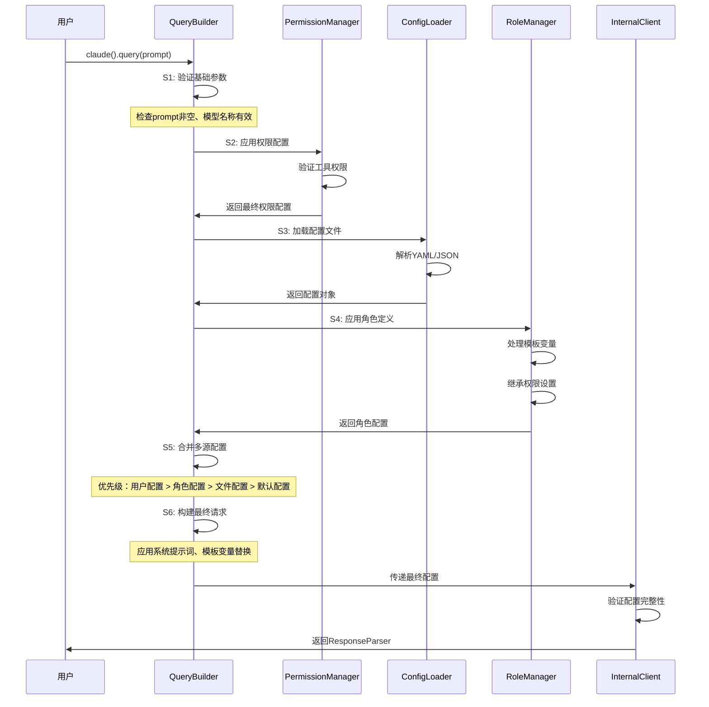
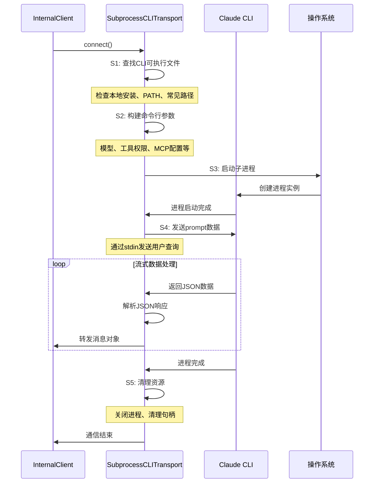
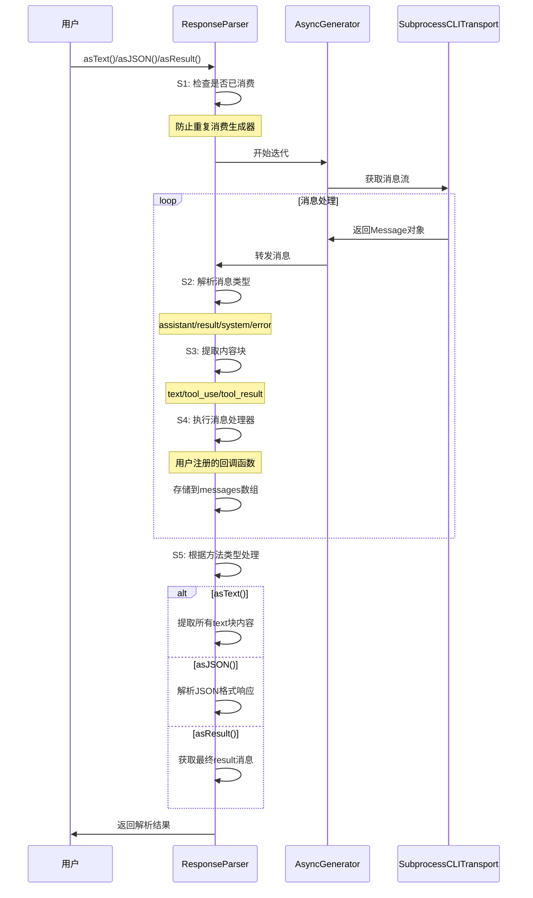
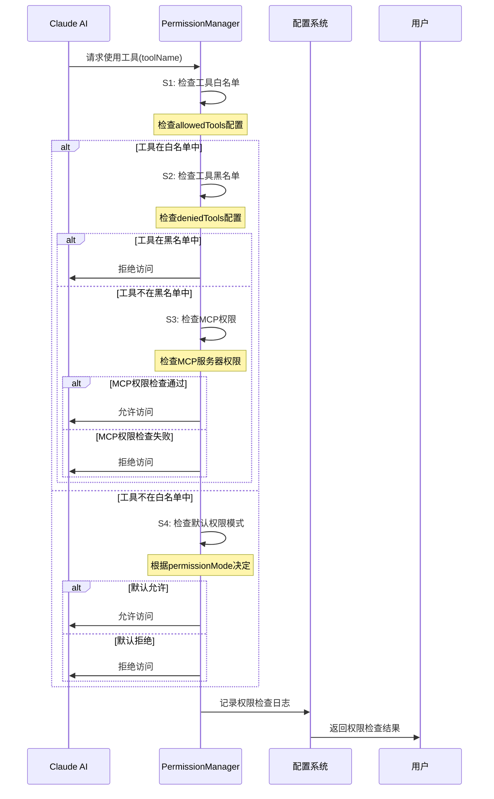
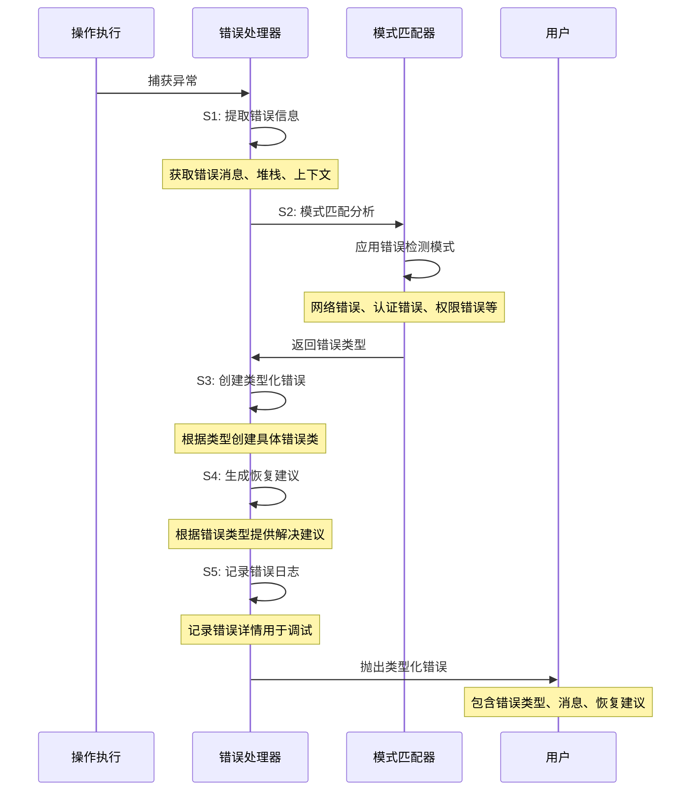
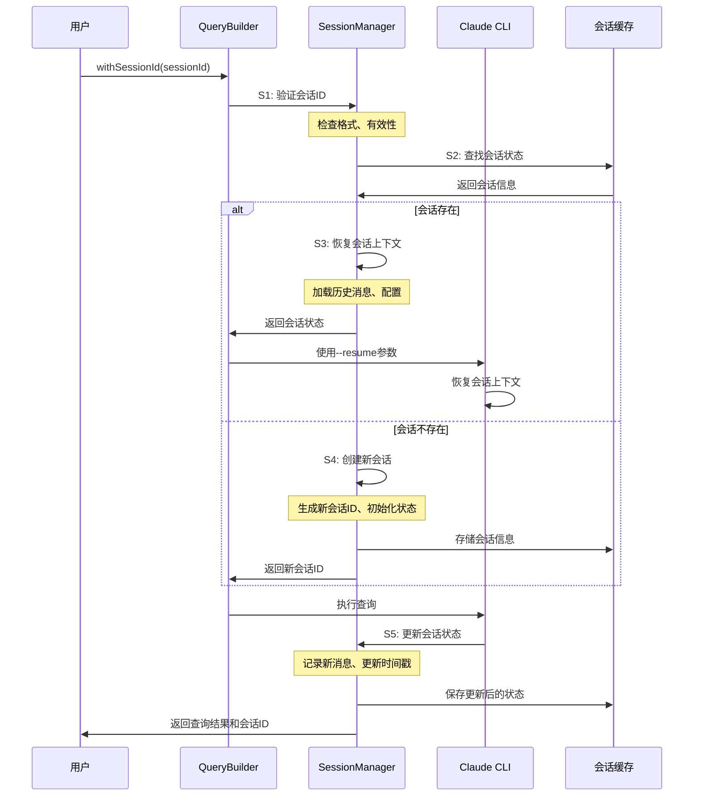
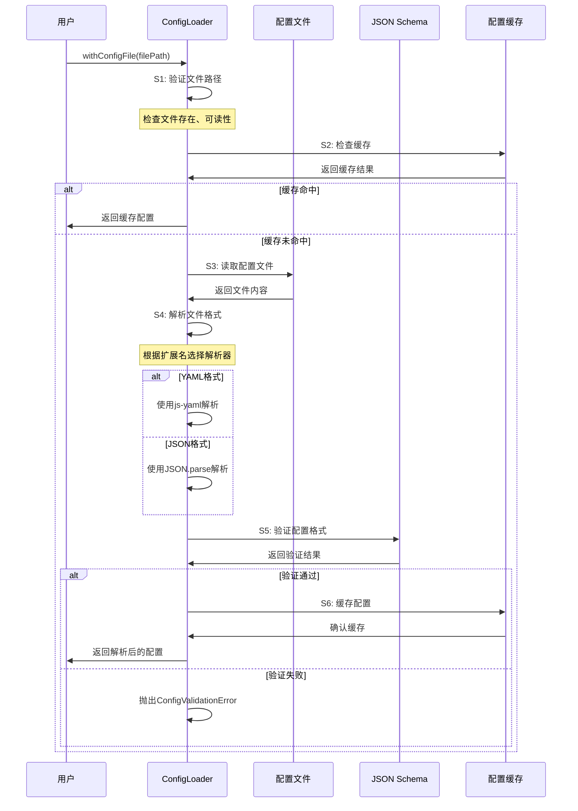
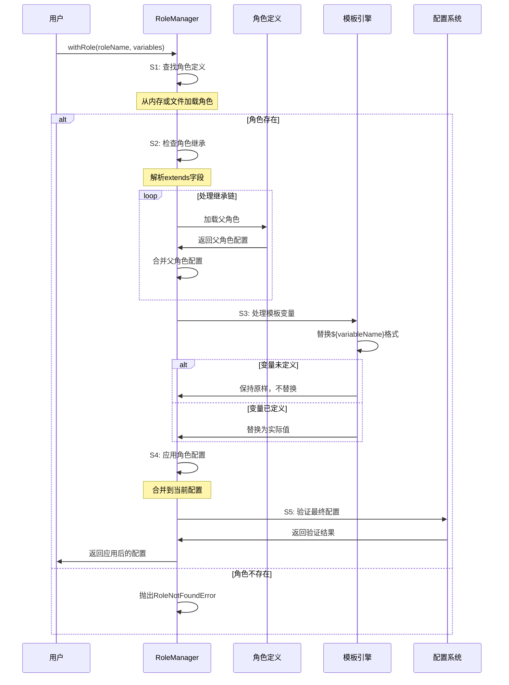
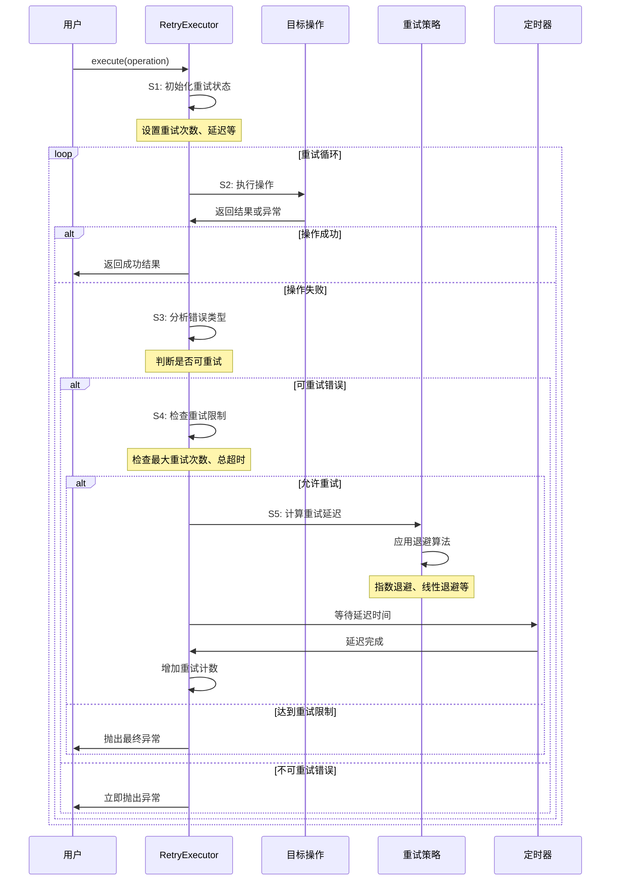
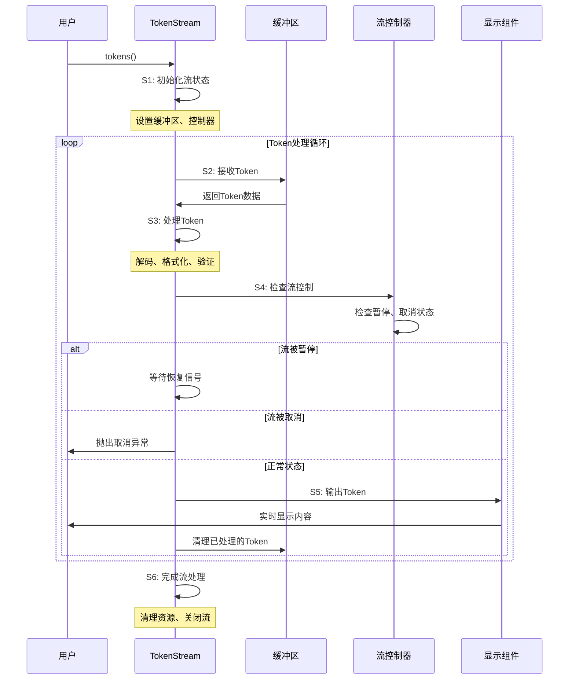

# cc-sdk-demo 复杂流程深度分析

本文档针对cc-sdk-demo项目中重要程度为"高"和"中"的核心复杂流程进行深度分析，包含流程概述、时序图、关键配置项和详细步骤分析。

## 一、查询构建与验证流程

### 流程概述
**业务目标**：构建完整的查询请求，验证参数合法性，合并多源配置，确保请求的完整性和安全性。

**触发条件**：用户调用`claude().query(prompt)`方法时触发。

**潜在核心问题**：配置冲突导致的行为不一致，权限验证失败导致的请求被拒绝。

**关键非功能点**：
- 性能要求：配置合并应在100ms内完成
- 数据一致性：确保配置优先级正确应用
- 安全性：权限验证必须严格，防止越权访问

### Mermaid时序图

### 关键配置项

| 配置项 | 来源 | 默认值 | 说明 |
|--------|------|--------|------|
| `model` | 用户/角色/文件 | `claude-3-5-sonnet-20241022` | Claude模型选择 |
| `allowedTools` | 用户/角色/文件 | `[]` | 允许使用的工具列表 |
| `deniedTools` | 用户/角色/文件 | `[]` | 禁止使用的工具列表 |
| `permissionMode` | 用户/角色/文件 | `default` | 权限模式：default/acceptEdits/bypassPermissions |
| `timeout` | 用户/角色/文件 | `30000` | 请求超时时间(ms) |
| `systemPrompt` | 角色/文件 | `null` | 系统级提示词 |
| `mcpServerPermissions` | 用户/文件 | `{}` | MCP服务器权限配置 |

### 详细步骤分析

**S1: 验证基础参数**
- **关键作用**：确保输入参数的基本有效性
- **核心业务规则**：
  - `prompt`必须为非空字符串，长度不超过10000字符
  - `model`必须是有效的Claude模型名称
  - 工作目录`cwd`必须存在且可访问

**S2: 应用权限配置**
- **关键作用**：确保工具访问权限的安全性
- **核心业务规则**：
  - 如果`allowedTools`和`deniedTools`同时存在，`deniedTools`优先级更高
  - 危险工具（如`Bash`、`Delete`）默认被禁止
  - MCP服务器权限必须明确配置为`whitelist`、`blacklist`或`ask`

**S3: 加载配置文件**
- **关键作用**：从外部文件加载配置，支持环境特定设置
- **核心业务规则**：
  - 支持YAML和JSON格式配置文件
  - 配置文件路径必须存在且可读
  - 配置内容必须通过JSON Schema验证

**S4: 应用角色定义**
- **关键作用**：应用预定义的角色配置，支持模板变量
- **核心业务规则**：
  - 角色可以继承其他角色的配置
  - 模板变量格式：`${variableName}`
  - 未定义的模板变量保持原样，不进行替换

**S5: 合并多源配置**
- **关键作用**：按照优先级合并所有配置源
- **核心业务规则**：
  - 优先级顺序：用户配置 > 角色配置 > 文件配置 > 默认配置
  - 数组类型配置（如`allowedTools`）进行合并而非覆盖
  - 对象类型配置进行深度合并

**S6: 构建最终请求**
- **关键作用**：组装完整的请求参数
- **核心业务规则**：
  - 系统提示词优先于角色提示词
  - 模板变量替换必须在最终prompt构建前完成
  - 所有配置项必须通过最终验证

## 二、子进程通信管理流程

### 流程概述
**业务目标**：建立与Claude CLI的稳定通信，管理进程生命周期，处理流式数据传输。

**触发条件**：InternalClient调用`processQuery()`方法时触发。

**潜在核心问题**：进程泄漏导致资源耗尽，通信超时导致请求失败。

**关键非功能点**：
- 性能要求：进程启动时间不超过2秒
- 可靠性：支持进程异常恢复和自动重试
- 资源管理：确保进程正确清理，避免僵尸进程

### Mermaid时序图

### 关键配置项

| 配置项 | 来源 | 默认值 | 说明 |
|--------|------|--------|------|
| `cwd` | 用户配置 | `process.cwd()` | 子进程工作目录 |
| `env` | 用户配置 | `process.env` | 子进程环境变量 |
| `timeout` | 用户配置 | `30000` | 进程超时时间 |
| `debug` | 环境变量 | `false` | 调试模式开关 |
| `signal` | 用户配置 | `null` | 取消信号 |

### 详细步骤分析

**S1: 查找CLI可执行文件**
- **关键作用**：定位Claude CLI的安装位置
- **核心业务规则**：
  - 优先检查本地安装路径：`~/.claude/local/claude`
  - 其次检查PATH中的`claude`和`claude-code`
  - 最后检查常见安装路径（Homebrew、npm全局等）
  - 找到后验证可执行权限

**S2: 构建命令行参数**
- **关键作用**：将SDK配置转换为CLI命令行参数
- **核心业务规则**：
  - 使用`--output-format stream-json`确保JSON输出
  - 工具权限使用`--allowedTools`和`--disallowedTools`
  - MCP配置通过`--mcp-config`传递JSON字符串
  - 权限模式`bypassPermissions`映射为`--dangerously-skip-permissions`

**S3: 启动子进程**
- **关键作用**：创建与CLI的进程间通信
- **核心业务规则**：
  - 使用`execa`库启动进程，设置`stdin: 'pipe'`
  - 设置环境变量`CLAUDE_CODE_ENTRYPOINT: 'sdk-ts'`
  - 配置工作目录和环境变量
  - 设置AbortSignal处理取消操作

**S4: 发送prompt数据**
- **关键作用**：向CLI发送用户查询
- **核心业务规则**：
  - 通过`stdin.write()`发送prompt字符串
  - 调用`stdin.end()`表示输入完成
  - 确保数据完整发送，处理写入错误

**S5: 清理资源**
- **关键作用**：确保进程和资源正确释放
- **核心业务规则**：
  - 检查进程是否仍在运行，如果是则调用`kill()`
  - 清理AbortSignal监听器
  - 关闭所有文件描述符
  - 等待进程完全退出

## 三、响应流式解析流程

### 流程概述
**业务目标**：实时解析Claude CLI的流式响应，提取有用信息，提供多种解析方式。

**触发条件**：用户调用ResponseParser的解析方法时触发。

**潜在核心问题**：数据不完整导致解析失败，内存泄漏导致性能问题。

**关键非功能点**：
- 性能要求：解析延迟不超过50ms
- 内存效率：避免大量数据在内存中累积
- 错误恢复：解析错误时能够继续处理后续数据

### Mermaid时序图

### 关键配置项

| 配置项 | 来源 | 默认值 | 说明 |
|--------|------|--------|------|
| `consumed` | 内部状态 | `false` | 生成器是否已消费 |
| `messages` | 内部状态 | `[]` | 存储的消息数组 |
| `handlers` | 用户配置 | `[]` | 消息处理器数组 |

### 详细步骤分析

**S1: 检查是否已消费**
- **关键作用**：防止重复消费AsyncGenerator
- **核心业务规则**：
  - 每个ResponseParser实例只能消费一次生成器
  - 设置`consumed`标志防止重复调用
  - 如果已消费，直接返回缓存结果

**S2: 解析消息类型**
- **关键作用**：识别消息类型并分类处理
- **核心业务规则**：
  - `assistant`：包含Claude的回复内容
  - `result`：包含最终结果和使用统计
  - `system`：系统级消息，通常跳过
  - `error`：错误消息，抛出异常

**S3: 提取内容块**
- **关键作用**：从assistant消息中提取具体内容
- **核心业务规则**：
  - `text`块：纯文本内容，直接提取
  - `tool_use`块：工具使用请求，记录工具名和参数
  - `tool_result`块：工具执行结果，关联到对应的tool_use

**S4: 执行消息处理器**
- **关键作用**：执行用户注册的回调函数
- **核心业务规则**：
  - 按注册顺序执行所有处理器
  - 处理器异常不影响其他处理器
  - 记录处理器执行错误到日志

**S5: 根据方法类型处理**
- **关键作用**：根据用户调用的方法返回相应格式
- **核心业务规则**：
  - `asText()`：连接所有text块内容
  - `asJSON()`：尝试解析JSON格式响应
  - `asResult()`：返回最后一个result消息
  - `asToolExecutions()`：关联tool_use和tool_result

## 四、工具权限控制流程

### 流程概述
**业务目标**：严格控制Claude对工具的访问权限，确保安全性和可控性。

**触发条件**：每次工具使用请求时触发权限检查。

**潜在核心问题**：权限绕过导致安全漏洞，权限配置错误导致功能不可用。

**关键非功能点**：
- 安全性：权限检查必须严格，不允许绕过
- 性能要求：权限检查延迟不超过10ms
- 可配置性：支持细粒度的权限控制

### Mermaid时序图

### 关键配置项

| 配置项 | 来源 | 默认值 | 说明 |
|--------|------|--------|------|
| `allowedTools` | 用户/角色/文件 | `[]` | 明确允许的工具列表 |
| `deniedTools` | 用户/角色/文件 | `[]` | 明确禁止的工具列表 |
| `permissionMode` | 用户/角色/文件 | `default` | 默认权限模式 |
| `mcpServerPermissions` | 用户/文件 | `{}` | MCP服务器权限配置 |

### 详细步骤分析

**S1: 检查工具白名单**
- **关键作用**：验证工具是否在允许列表中
- **核心业务规则**：
  - 如果`allowedTools`为空数组，表示只读模式
  - 如果`allowedTools`包含`*`，表示允许所有工具
  - 工具名称必须完全匹配，区分大小写

**S2: 检查工具黑名单**
- **关键作用**：验证工具是否在禁止列表中
- **核心业务规则**：
  - 黑名单优先级高于白名单
  - 即使工具在白名单中，如果在黑名单中也会被拒绝
  - 危险工具（如`Bash`、`Delete`）默认在黑名单中

**S3: 检查MCP权限**
- **关键作用**：验证MCP服务器级别的权限
- **核心业务规则**：
  - 根据工具名映射到对应的MCP服务器
  - 检查服务器权限：`whitelist`/`blacklist`/`ask`
  - 如果权限为`ask`，需要用户交互确认

**S4: 检查默认权限模式**
- **关键作用**：当工具不在明确列表中时的默认行为
- **核心业务规则**：
  - `default`：拒绝未知工具
  - `acceptEdits`：允许编辑类工具
  - `bypassPermissions`：跳过所有权限检查（危险）

## 五、错误分类与处理流程

### 流程概述
**业务目标**：智能识别和分类各种错误类型，提供用户友好的错误信息和恢复建议。

**触发条件**：任何操作过程中发生异常时触发。

**潜在核心问题**：错误误判导致处理不当，错误信息泄露敏感信息。

**关键非功能点**：
- 准确性：错误分类必须准确，避免误判
- 安全性：错误信息不能泄露敏感信息
- 可用性：提供明确的恢复建议

### Mermaid时序图

### 关键配置项

| 配置项 | 来源 | 默认值 | 说明 |
|--------|------|--------|------|
| `ErrorDetectionPatterns` | 内置配置 | 预定义模式 | 错误检测正则表达式 |
| `errorLogging` | 用户配置 | `true` | 错误日志记录开关 |
| `errorRecovery` | 用户配置 | `true` | 错误恢复建议开关 |

### 详细步骤分析

**S1: 提取错误信息**
- **关键作用**：收集完整的错误上下文信息
- **核心业务规则**：
  - 提取错误消息、错误代码、堆栈跟踪
  - 收集操作上下文（如请求参数、配置信息）
  - 过滤敏感信息（如API密钥、文件路径）

**S2: 模式匹配分析**
- **关键作用**：使用正则表达式识别错误类型
- **核心业务规则**：
  - 按优先级顺序检查错误模式
  - 网络错误：连接超时、DNS解析失败
  - 认证错误：API密钥无效、权限不足
  - 权限错误：工具访问被拒绝、文件权限不足
  - 配置错误：配置文件格式错误、参数无效

**S3: 创建类型化错误**
- **关键作用**：根据错误类型创建具体的错误类
- **核心业务规则**：
  - `NetworkError`：网络连接问题
  - `AuthenticationError`：认证失败
  - `PermissionError`：权限不足
  - `ValidationError`：参数验证失败
  - `TimeoutError`：操作超时

**S4: 生成恢复建议**
- **关键作用**：为用户提供具体的解决建议
- **核心业务规则**：
  - 网络错误：检查网络连接、重试操作
  - 认证错误：验证API密钥、重新登录
  - 权限错误：检查工具权限配置
  - 配置错误：验证配置文件格式

**S5: 记录错误日志**
- **关键作用**：记录错误详情用于调试和监控
- **核心业务规则**：
  - 记录错误类型、消息、堆栈跟踪
  - 记录操作上下文（不包含敏感信息）
  - 记录时间戳和错误ID
  - 根据日志级别决定是否记录详细信息

## 六、会话状态管理流程

### 流程概述
**业务目标**：维护跨请求的会话状态，支持上下文连续性，管理会话生命周期。

**触发条件**：用户使用`withSessionId()`或系统自动创建会话时触发。

**潜在核心问题**：状态不一致导致上下文丢失，内存泄漏导致资源耗尽。

**关键非功能点**：
- 一致性：确保会话状态在多个请求间保持一致
- 性能要求：会话查找和恢复时间不超过100ms
- 资源管理：及时清理过期会话，避免内存泄漏

### Mermaid时序图

### 关键配置项

| 配置项 | 来源 | 默认值 | 说明 |
|--------|------|--------|------|
| `sessionId` | 用户配置 | `null` | 会话标识符 |
| `sessionTimeout` | 用户配置 | `3600000` | 会话超时时间(ms) |
| `maxSessionSize` | 用户配置 | `1000` | 最大会话消息数 |
| `sessionStorage` | 用户配置 | `memory` | 会话存储方式 |

### 详细步骤分析

**S1: 验证会话ID**
- **关键作用**：确保会话ID的格式和有效性
- **核心业务规则**：
  - 会话ID必须是有效的UUID格式
  - 检查会话ID长度和字符集
  - 验证会话ID是否过期

**S2: 查找会话状态**
- **关键作用**：从存储中检索会话信息
- **核心业务规则**：
  - 根据会话ID查找会话记录
  - 检查会话是否仍然有效
  - 如果会话过期，标记为无效

**S3: 恢复会话上下文**
- **关键作用**：加载历史消息和配置信息
- **核心业务规则**：
  - 恢复历史消息列表
  - 恢复会话配置（模型、工具权限等）
  - 验证上下文完整性

**S4: 创建新会话**
- **关键作用**：为新的对话创建会话记录
- **核心业务规则**：
  - 生成唯一的会话ID
  - 初始化会话状态和配置
  - 设置创建时间和过期时间

**S5: 更新会话状态**
- **关键作用**：记录新的交互信息
- **核心业务规则**：
  - 添加新的消息到历史记录
  - 更新最后活动时间
  - 检查会话大小限制，必要时清理旧消息

## 七、配置加载与合并流程

### 流程概述
**业务目标**：从多个配置源加载配置，按照优先级合并，确保配置的一致性和有效性。

**触发条件**：用户调用`withConfigFile()`或系统初始化时触发。

**潜在核心问题**：配置冲突导致行为不一致，配置文件格式错误导致加载失败。

**关键非功能点**：
- 一致性：确保配置合并的优先级规则正确
- 性能要求：配置文件加载时间不超过500ms
- 容错性：配置文件错误不应影响系统运行

### Mermaid时序图

### 关键配置项

| 配置项 | 来源 | 默认值 | 说明 |
|--------|------|--------|------|
| `configFile` | 用户配置 | `null` | 配置文件路径 |
| `configCache` | 内部配置 | `true` | 配置缓存开关 |
| `configValidation` | 内部配置 | `true` | 配置验证开关 |
| `configPriority` | 内部配置 | 预定义规则 | 配置优先级规则 |

### 详细步骤分析

**S1: 验证文件路径**
- **关键作用**：确保配置文件路径的有效性
- **核心业务规则**：
  - 检查文件是否存在且可读
  - 验证文件扩展名（.yaml、.yml、.json）
  - 检查文件大小限制（不超过1MB）

**S2: 检查缓存**
- **关键作用**：避免重复解析相同的配置文件
- **核心业务规则**：
  - 使用文件路径和修改时间作为缓存键
  - 缓存有效期设置为5分钟
  - 如果文件被修改，清除缓存

**S3: 读取配置文件**
- **关键作用**：从文件系统读取配置内容
- **核心业务规则**：
  - 使用UTF-8编码读取文件
  - 处理文件读取异常
  - 验证文件内容不为空

**S4: 解析文件格式**
- **关键作用**：根据文件格式选择正确的解析器
- **核心业务规则**：
  - YAML文件使用js-yaml库解析
  - JSON文件使用JSON.parse解析
  - 解析失败时提供详细的错误信息

**S5: 验证配置格式**
- **关键作用**：确保配置内容符合预期的格式
- **核心业务规则**：
  - 使用JSON Schema验证配置结构
  - 检查必需字段是否存在
  - 验证字段类型和取值范围

**S6: 缓存配置**
- **关键作用**：将解析后的配置存储到缓存中
- **核心业务规则**：
  - 使用内存缓存存储配置对象
  - 设置合理的缓存过期时间
  - 监控缓存大小，避免内存泄漏

## 八、角色系统管理流程

### 流程概述
**业务目标**：管理预定义的角色配置，支持角色继承和模板变量替换，提供可重用的配置模板。

**触发条件**：用户调用`withRole()`方法时触发。

**潜在核心问题**：角色冲突导致配置错误，模板变量未定义导致替换失败。

**关键非功能点**：
- 灵活性：支持复杂的角色继承和模板变量
- 性能要求：角色应用时间不超过200ms
- 可维护性：角色定义应该清晰易懂

### Mermaid时序图

### 关键配置项

| 配置项 | 来源 | 默认值 | 说明 |
|--------|------|--------|------|
| `roleName` | 用户配置 | `null` | 角色名称 |
| `templateVariables` | 用户配置 | `{}` | 模板变量值 |
| `roleInheritance` | 角色定义 | `false` | 是否支持继承 |
| `roleValidation` | 内部配置 | `true` | 角色验证开关 |

### 详细步骤分析

**S1: 查找角色定义**
- **关键作用**：从角色存储中检索角色配置
- **核心业务规则**：
  - 首先从内存缓存中查找角色
  - 如果未找到，从配置文件加载
  - 角色名称区分大小写

**S2: 检查角色继承**
- **关键作用**：处理角色的继承关系
- **核心业务规则**：
  - 解析`extends`字段指定的父角色
  - 递归加载所有父角色
  - 子角色配置覆盖父角色配置
  - 检测循环继承并抛出异常

**S3: 处理模板变量**
- **关键作用**：替换角色定义中的模板变量
- **核心业务规则**：
  - 识别`${variableName}`格式的变量
  - 从用户提供的变量中查找值
  - 未定义的变量保持原样
  - 支持嵌套变量引用

**S4: 应用角色配置**
- **关键作用**：将角色配置合并到当前配置中
- **核心业务规则**：
  - 按照配置优先级合并
  - 数组类型配置进行合并
  - 对象类型配置进行深度合并
  - 保留用户配置的优先级

**S5: 验证最终配置**
- **关键作用**：确保应用角色后的配置有效
- **核心业务规则**：
  - 验证所有必需字段
  - 检查字段类型和取值范围
  - 验证工具权限配置
  - 检查配置冲突

## 九、重试机制执行流程

### 流程概述
**业务目标**：在操作失败时自动重试，使用智能的重试策略提高成功率。

**触发条件**：操作失败且符合重试条件时触发。

**潜在核心问题**：无限重试导致资源浪费，重试策略不当导致性能问题。

**关键非功能点**：
- 可靠性：重试机制应该提高操作成功率
- 性能要求：重试延迟应该合理，避免过度延迟
- 资源控制：限制重试次数，避免资源耗尽

### Mermaid时序图

### 关键配置项

| 配置项 | 来源 | 默认值 | 说明 |
|--------|------|--------|------|
| `maxAttempts` | 用户配置 | `3` | 最大重试次数 |
| `initialDelay` | 用户配置 | `1000` | 初始延迟时间(ms) |
| `maxDelay` | 用户配置 | `30000` | 最大延迟时间(ms) |
| `multiplier` | 用户配置 | `2` | 退避倍数 |
| `jitter` | 用户配置 | `true` | 是否添加随机抖动 |

### 详细步骤分析

**S1: 初始化重试状态**
- **关键作用**：设置重试相关的初始参数
- **核心业务规则**：
  - 设置重试计数器为0
  - 记录开始时间用于总超时检查
  - 初始化重试策略（指数退避、线性退避等）

**S2: 执行操作**
- **关键作用**：尝试执行目标操作
- **核心业务规则**：
  - 捕获操作执行过程中的所有异常
  - 记录操作执行时间
  - 区分成功和失败结果

**S3: 分析错误类型**
- **关键作用**：判断错误是否适合重试
- **核心业务规则**：
  - 网络错误、超时错误通常可重试
  - 认证错误、权限错误通常不可重试
  - 配置错误、参数错误通常不可重试

**S4: 检查重试限制**
- **关键作用**：确保重试次数和总时间在合理范围内
- **核心业务规则**：
  - 检查当前重试次数是否超过最大值
  - 检查总执行时间是否超过总超时
  - 检查AbortSignal是否已触发

**S5: 计算重试延迟**
- **关键作用**：使用退避算法计算下次重试的延迟时间
- **核心业务规则**：
  - 指数退避：delay = min(initialDelay * 2^attempt, maxDelay)
  - 线性退避：delay = min(initialDelay * attempt, maxDelay)
  - 添加随机抖动避免重试风暴
  - 确保延迟时间在合理范围内

## 十、Token流式处理流程

### 流程概述
**业务目标**：实时处理Claude的Token流，提供字符级别的流式显示效果。

**触发条件**：用户调用流式处理方法时触发。

**潜在核心问题**：流控制不当导致性能问题，缓冲区溢出导致内存问题。

**关键非功能点**：
- 实时性：Token处理延迟不超过10ms
- 内存效率：避免大量Token在内存中累积
- 流控制：支持暂停、恢复、取消操作

### Mermaid时序图

### 关键配置项

| 配置项 | 来源 | 默认值 | 说明 |
|--------|------|--------|------|
| `bufferSize` | 用户配置 | `1000` | 缓冲区大小 |
| `flushInterval` | 用户配置 | `50` | 刷新间隔(ms) |
| `maxTokens` | 用户配置 | `10000` | 最大Token数 |
| `streamControl` | 用户配置 | `true` | 流控制开关 |

### 详细步骤分析

**S1: 初始化流状态**
- **关键作用**：设置Token流处理的基础设施
- **核心业务规则**：
  - 创建Token缓冲区
  - 初始化流控制器
  - 设置流状态为活跃

**S2: 接收Token**
- **关键作用**：从Claude接收Token数据
- **核心业务规则**：
  - 从底层流中读取Token
  - 验证Token格式和完整性
  - 将Token添加到缓冲区

**S3: 处理Token**
- **关键作用**：对Token进行必要的处理
- **核心业务规则**：
  - 解码Token内容
  - 格式化Token显示
  - 验证Token有效性

**S4: 检查流控制**
- **关键作用**：响应流控制命令
- **核心业务规则**：
  - 检查暂停状态，暂停时等待恢复
  - 检查取消状态，取消时抛出异常
  - 检查缓冲区大小，必要时进行清理

**S5: 输出Token**
- **关键作用**：将处理后的Token输出给用户
- **核心业务规则**：
  - 实时输出Token内容
  - 支持字符级别的显示效果
  - 处理输出错误

**S6: 完成流处理**
- **关键作用**：清理资源并关闭流
- **核心业务规则**：
  - 清空缓冲区
  - 关闭流控制器
  - 释放相关资源
