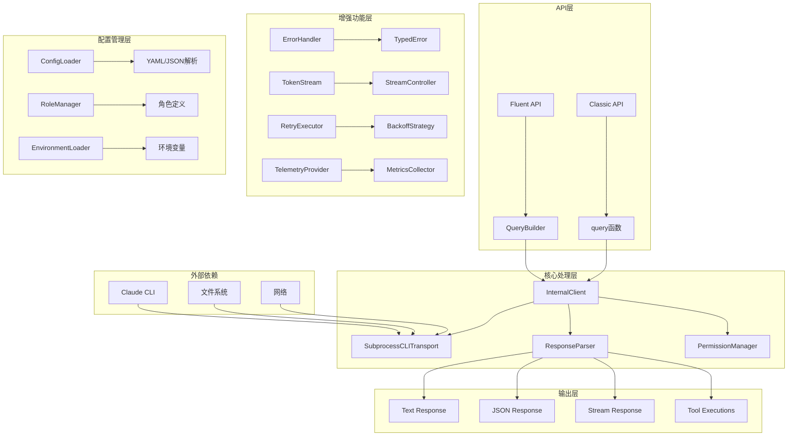
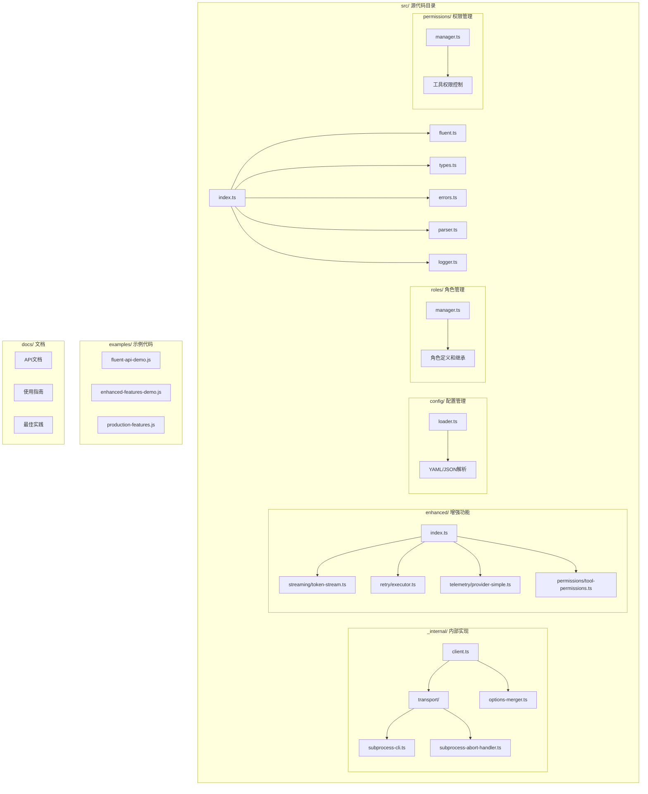
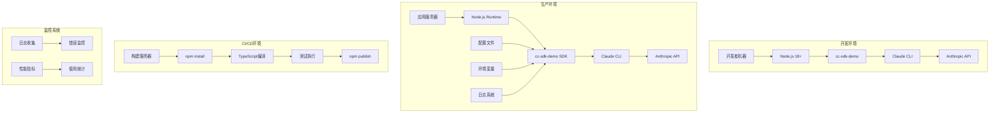
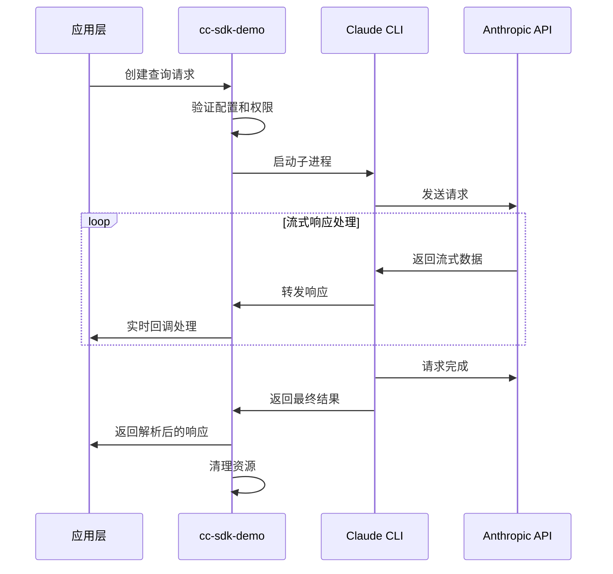
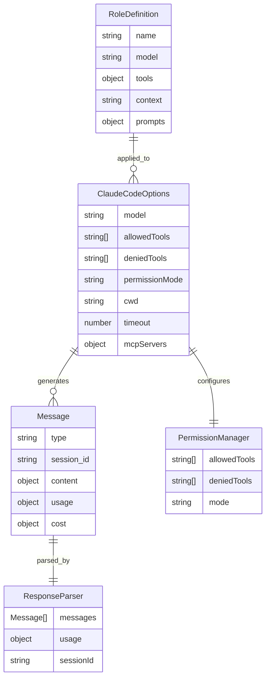

# cc-sdk-demo 项目技术总览

## Part A: 项目概述

### 项目背景与使命
cc-sdk-demo 是一个非官方的 TypeScript SDK，用于与 Anthropic 的 Claude Code CLI 工具进行交互。该项目是官方 Python SDK 的 TypeScript 移植版本，旨在为 TypeScript/JavaScript 开发者提供类型安全、现代化的 Claude Code 集成体验。

**核心价值**：
- 提供完整的 TypeScript 类型支持，确保开发时的类型安全
- 实现双重 API 设计（传统函数式 + 现代 Fluent API），满足不同开发偏好
- 支持生产级特性，包括错误处理、重试机制、监控和日志
- 提供精细化的工具权限控制，确保安全性

### 主要用户角色与场景

| 用户角色 | 使用场景 | 核心需求 |
|---------|---------|---------|
| **前端开发者** | 代码分析、重构、文档生成 | 类型安全、易用性、快速集成 |
| **后端开发者** | 自动化代码审查、CI/CD集成 | 可靠性、错误处理、生产就绪 |
| **DevOps工程师** | 部署脚本、监控集成 | 稳定性、日志记录、配置管理 |
| **AI应用开发者** | 构建AI驱动的开发工具 | 流式处理、会话管理、扩展性 |

## Part B: 技术栈详解

| 技术类别 | 组件名称 | 版本 | 用途说明 |
|---------|---------|------|---------|
| **编程语言** | TypeScript | 5.3+ | 主要开发语言，提供类型安全 |
| **运行时** | Node.js | 18+ | JavaScript 运行时环境 |
| **构建工具** | tsup | 8.0.1 | 现代化构建工具，支持多格式输出 |
| **包管理** | npm | - | 依赖管理和发布 |
| **测试框架** | Vitest | 3.2.4 | 单元测试和覆盖率统计 |
| **代码质量** | ESLint | 8.54.0 | 代码规范和静态分析 |
| **代码格式化** | Prettier | 3.1.0 | 代码格式化工具 |
| **类型检查** | TypeScript Compiler | 5.3.0 | 类型检查和编译 |
| **依赖库** | execa | 8.0.1 | 子进程执行和进程管理 |
| **依赖库** | js-yaml | 4.1.0 | YAML 配置文件解析 |
| **依赖库** | which | 4.0.0 | 可执行文件路径查找 |
| **开发工具** | @typescript-eslint | 6.13.0 | TypeScript ESLint 规则 |
| **开发工具** | @vitest/coverage-v8 | 3.2.4 | 测试覆盖率统计 |

## Part C: 架构五视图分析

### 1. 逻辑视图 (Logical View)

**逻辑视图解释**：
一个典型的API调用流程从Fluent API或Classic API开始，通过QueryBuilder构建查询参数，然后由InternalClient协调整个处理过程。InternalClient依赖SubprocessCLITransport与Claude CLI进行通信，使用ResponseParser解析响应，并通过PermissionManager控制工具权限。增强功能层提供错误处理、流式处理、重试机制和遥测功能。配置管理层支持多种配置方式，包括YAML/JSON文件、角色定义和环境变量。

### 2. 开发视图 (Development View)

**开发视图解释**：
项目采用模块化设计，src/目录包含所有核心源代码。index.ts作为主入口，导出所有公共API。_internal/目录包含内部实现细节，enhanced/目录提供高级功能。config/、roles/、permissions/目录分别处理配置管理、角色定义和权限控制。examples/目录提供丰富的使用示例，docs/目录包含完整的文档。模块间依赖关系清晰，遵循单一职责原则。

### 3. 部署视图 (Deployment View)

**部署视图解释**：
在开发环境中，SDK直接运行在开发者的Node.js环境中，通过Claude CLI与Anthropic API通信。在生产环境中，SDK作为应用的一部分部署在应用服务器上，通过配置文件和环境变量进行配置，并集成日志和监控系统。CI/CD环境负责构建、测试和发布流程。监控系统收集日志、错误和性能指标。

### 4. 运行视图 (Runtime View)

**运行视图解释**：
运行时采用异步非阻塞模式，支持并发处理多个请求。SDK通过子进程与Claude CLI通信，实现进程隔离。支持流式响应处理，通过回调机制实时返回数据。采用事件驱动架构，支持消息处理、工具使用事件和错误处理。包含完整的资源管理和清理机制。

### 5. 数据视图 (Data View)

**数据视图解释**：
核心数据结构包括ClaudeCodeOptions（配置选项）、Message（消息对象）、ResponseParser（响应解析器）、PermissionManager（权限管理器）和RoleDefinition（角色定义）。ClaudeCodeOptions包含模型选择、工具权限、工作目录等配置。Message对象包含类型、会话ID、内容和统计信息。ResponseParser负责解析和提取响应数据。PermissionManager管理工具访问权限。RoleDefinition定义可重用的角色配置。

## Part D: 核心复杂流程识别表

| 流程名称 | 流程入口函数 | 核心复杂性解释 | 潜在问题 | 重要程度 |
|---------|-------------|---------------|---------|---------|
| **查询构建与验证** | `QueryBuilder.query()` | 复杂的参数验证、配置合并、权限检查逻辑，需要处理多种配置源和继承关系 | 配置冲突、权限验证失败 | 高 |
| **子进程通信管理** | `SubprocessCLITransport.connect()` | 跨进程通信、进程生命周期管理、错误恢复、资源清理 | 进程泄漏、通信超时、僵尸进程 | 高 |
| **响应流式解析** | `ResponseParser.asText()` | 实时流式数据解析、消息类型识别、内容提取、错误处理 | 数据不完整、解析错误、内存泄漏 | 高 |
| **工具权限控制** | `PermissionManager.validatePermissions()` | 动态权限检查、工具白名单/黑名单管理、上下文相关权限 | 权限绕过、安全漏洞 | 高 |
| **错误分类与处理** | `detectErrorType()` | 错误类型识别、分类处理、恢复策略、用户友好提示 | 错误误判、处理不当 | 高 |
| **会话状态管理** | `QueryBuilder.withSessionId()` | 会话持久化、上下文维护、状态同步、清理机制 | 状态不一致、内存泄漏 | 中 |
| **配置加载与合并** | `ConfigLoader.loadConfig()` | 多源配置合并、优先级处理、类型验证、模板变量替换 | 配置冲突、加载失败 | 中 |
| **角色系统管理** | `RoleManager.applyRole()` | 角色继承、模板变量替换、权限继承、上下文设置 | 角色冲突、模板错误 | 中 |
| **重试机制执行** | `ClaudeRetryExecutor.execute()` | 指数退避算法、重试策略选择、错误分类、超时控制 | 无限重试、资源浪费 | 中 |
| **Token流式处理** | `TokenStreamImpl.tokens()` | 实时Token流处理、缓冲区管理、流控制、性能优化 | 流控制不当、性能问题 | 中 |
| **遥测数据收集** | `ClaudeTelemetryProvider.record()` | 性能指标收集、事件追踪、数据聚合、存储管理 | 数据丢失、性能影响 | 低 |
| **日志记录管理** | `ConsoleLogger.log()` | 多级别日志、格式化输出、性能优化、存储管理 | 日志丢失、性能影响 | 低 |
| **MCP服务器集成** | `QueryBuilder.withMCPServer()` | 外部服务集成、协议处理、错误处理、资源管理 | 服务不可用、协议错误 | 低 |
| **文件操作权限** | `PermissionManager.checkFileAccess()` | 文件系统权限检查、路径验证、安全控制 | 权限绕过、路径遍历 | 低 |
| **环境变量处理** | `loadSafeEnvironmentOptions()` | 环境变量加载、安全过滤、类型转换、默认值处理 | 配置错误、安全风险 | 低 |

