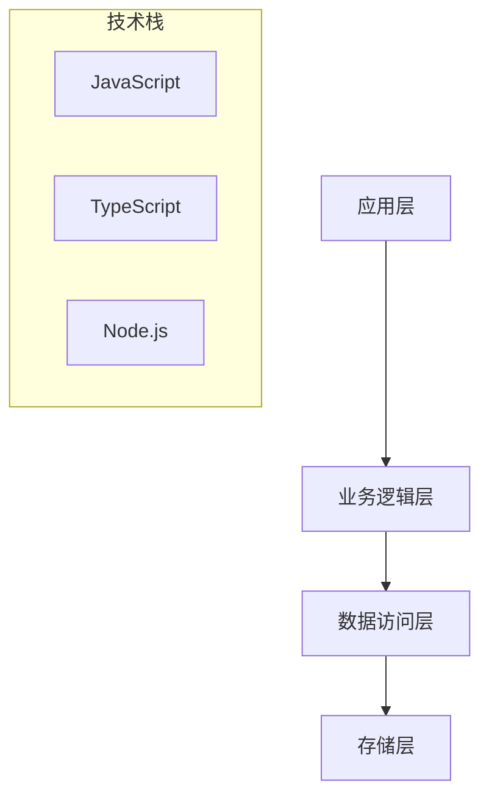

# cc-sdk-demo - 技术总览

## 项目概述
- **项目名称**: cc-sdk-demo
- **项目路径**: /Users/lshl124/Documents/daniel/git/code/aigc/cc-sdk-demo
- **技术栈**: JavaScript, TypeScript, Node.js

## 项目结构统计
- **总文件数**: 192
- **目录数量**: 76
- **代码文件**: 97
- **测试文件**: 7
- **配置文件**: 29

## 文件类型分布
- : 9 个文件
- .example: 1 个文件
- .json: 26 个文件
- .md: 32 个文件
- .sh: 11 个文件
- .js: 50 个文件
- .html: 8 个文件
- .css: 2 个文件
- .ts: 47 个文件
- .yaml: 3 个文件
- .txt: 3 个文件

## 复杂度评估
- **整体复杂度**: high
- **业务复杂度**: low
- **技术复杂度**: high

## 关键文件
- README.md
- package.json
- tsconfig.json

## 架构视图

## 改进建议
- 增加单元测试覆盖率，当前测试文件比例较低
- 考虑重构大型模块，降低整体复杂度
- 简化技术栈，减少不必要的依赖
- 定期进行代码审查，保持代码质量
- 建立完善的文档体系

## 潜在问题
- 混合使用JavaScript和TypeScript，建议统一语言

---
*文档生成时间: 2025/8/14 22:07:23*
*分析工具: Claude Code 文档生成器 (模拟模式)*