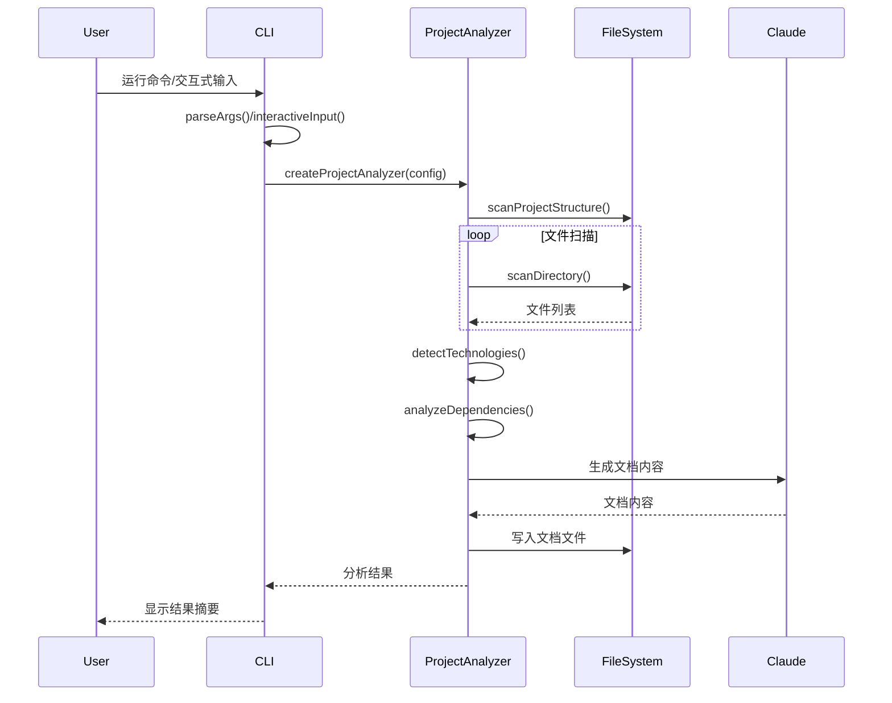
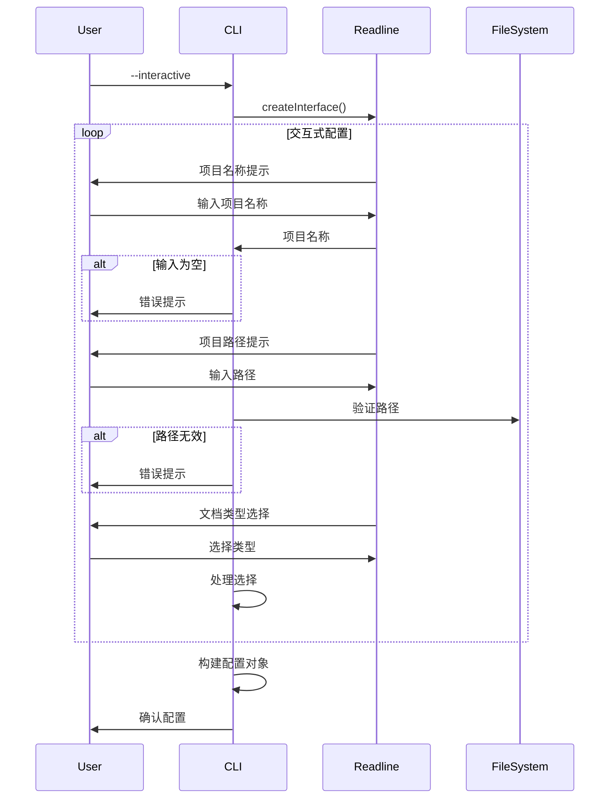
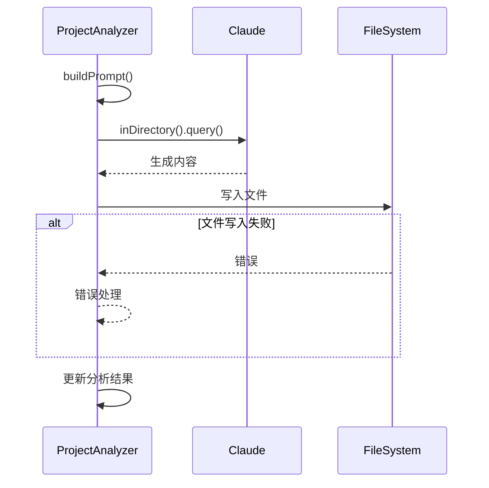

# 复杂流程分析文档

## 文档生成主流程

### 流程概述
- **业务目标**: 通过 Claude Code SDK 自动分析代码库并生成技术文档
- **触发条件**: 
  - CLI 命令行调用
  - 交互式菜单选择
- **核心问题**: 需要处理大量文件扫描、深度代码分析和 AI 生成
- **关键非功能点**: 性能、内存使用、错误处理、用户体验

### 时序图

### 关键配置项
- `maxFiles`: 限制扫描文件数量 (默认 200)
- `includeExtensions`: 包含的文件类型
- `excludePatterns`: 排除的目录模式
- `generateAll`: 是否生成所有文档类型
- Claude 模型配置: claude-3-5-sonnet-20241022

### 详细步骤分析
1. **命令行解析/交互式输入**
   - 支持多种输入方式的灵活配置
   - 提供合理的默认值
   - 输入验证和错误处理

2. **项目结构扫描**
   - 递归扫描目录
   - 文件分类与过滤
   - 构建目录树结构
   - 限制扫描深度和文件数

3. **依赖分析**
   - 解析 package.json
   - 提取依赖信息
   - 技术栈检测

4. **文档生成**
   - AI 提示词构建
   - Claude API 调用
   - 文件写入与错误处理

## 复杂流程交互式分析

### 流程概述
- **业务目标**: 提供友好的交互式配置界面
- **触发条件**: 使用 --interactive 参数
- **核心问题**: 用户输入处理和验证
- **关键非功能点**: 用户体验、输入验证、错误处理

### 时序图

### 关键配置项
- 默认项目路径: ./
- 默认输出目录: ./docs
- 默认文档类型: all
- 默认最大文件数: 200

### 详细步骤分析
1. **输入收集**
   - 项目名称验证 (不能为空)
   - 项目路径验证 (必须存在)
   - 文档类型选择 (1-4)
   - 高级选项配置

2. **配置构建**
   - 合并用户输入和默认值
   - 路径规范化
   - 参数验证

3. **错误处理**
   - 输入验证错误
   - 文件系统错误
   - 优雅的错误提示

## AI 文档生成流程

### 流程概述
- **业务目标**: 通过 AI 生成高质量技术文档
- **触发条件**: 项目分析完成后
- **核心问题**: 提示词构建和 AI 交互
- **关键非功能点**: 文档质量、性能、错误处理

### 时序图

### 关键配置项
- Claude API 超时: 120000ms
- 允许的工具: Read, Write, LS, Grep, Glob
- 文档类型配置
- 提示词模板配置

### 详细步骤分析
1. **提示词构建**
   - 技术总览提示词
   - 复杂流程提示词
   - 问题诊断提示词
   - 上下文信息注入

2. **AI 交互**
   - Claude 客户端配置
   - 查询执行
   - 结果处理

3. **文档生成**
   - 文件名构建
   - 内容写入
   - 元数据记录