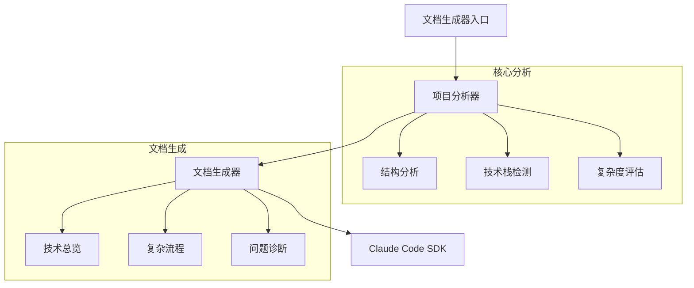
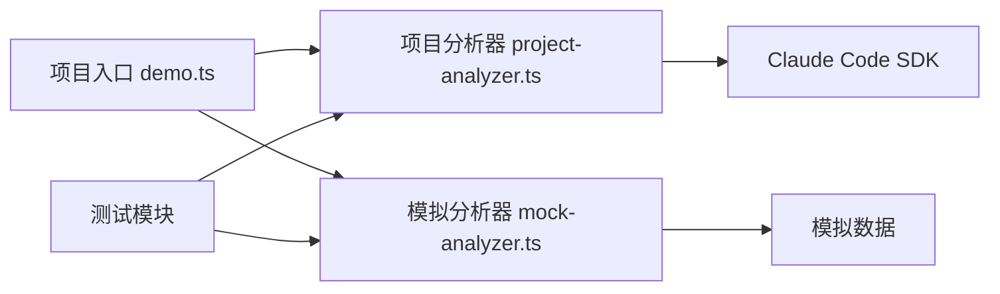
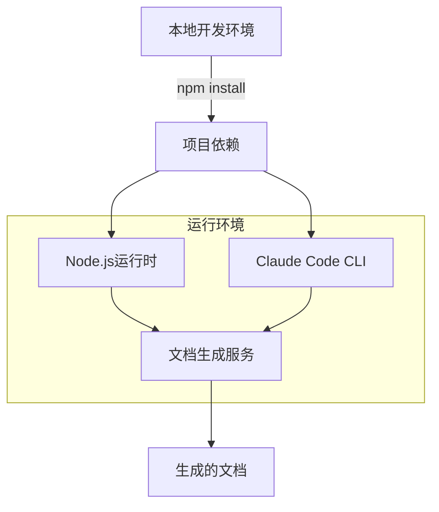
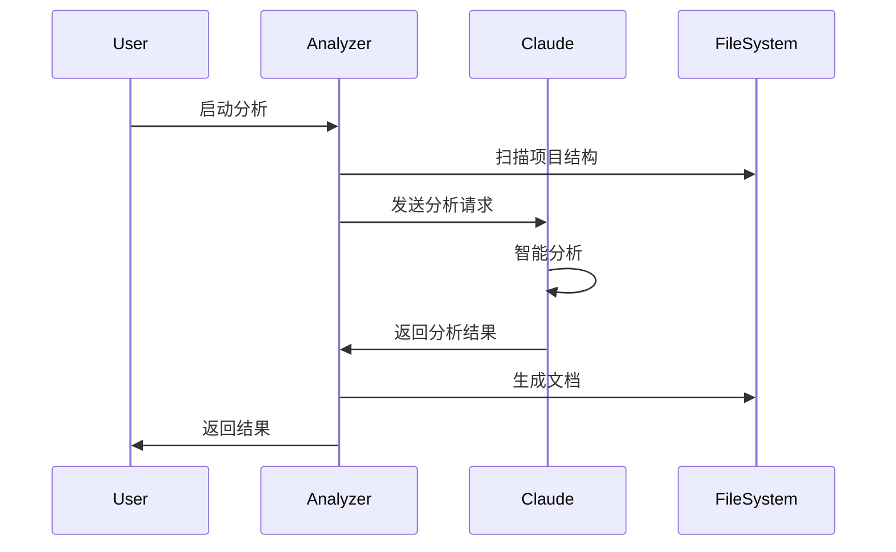
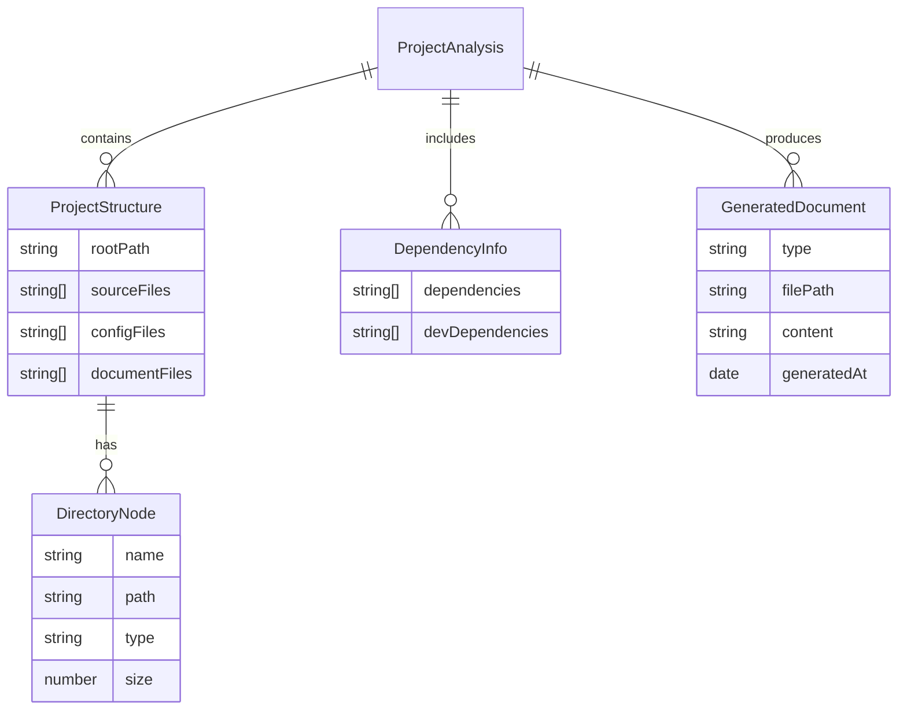

# TechStackTest - 技术总览

## Part A: 项目概述

### 项目背景与使命
本项目是一个基于 Claude Code CLI 的智能文档生成工具，主要用于对代码仓库进行深度分析并生成高质量的技术文档。它通过 AI 驱动的代码分析能力，帮助开发团队快速理解项目结构、识别复杂流程并生成标准化的技术文档。

### 主要用户角色与场景
- **开发团队**: 快速生成项目文档，理解代码结构
- **项目经理**: 评估项目复杂度，识别潜在问题
- **新团队成员**: 快速了解项目架构和关键流程
- **代码审查者**: 分析代码质量和复杂流程

## Part B: 技术栈详解

| 类别 | 组件 | 版本 | 用途 |
|------|------|------|------|
| 编程语言 | TypeScript | - | 主要开发语言 |
| 核心依赖 | claude-sdk | - | Claude Code CLI 交互 |
| 工具库 | fs-extra | - | 文件操作增强 |
| 工具库 | path | - | 路径处理 |
| 开发工具 | tsup | - | 构建工具 |
| 开发工具 | vitest | - | 测试框架 |

## Part C: 架构五视图分析

### 1. 逻辑视图

核心功能模块通过分层设计实现解耦。项目分析器负责深度分析代码结构，文档生成器基于分析结果生成不同类型的技术文档。

### 2. 开发视图

代码模块间通过清晰的接口定义实现交互，支持真实和模拟两种运行模式。

### 3. 部署视图

部署依赖简单，主要依赖 Node.js 环境和 Claude Code CLI。

### 4. 运行视图

采用异步模型处理文件IO和AI分析请求，保证性能和响应性。

### 5. 数据视图

## Part D: 核心复杂流程识别表

| 流程名称 | 流程入口函数 | 核心复杂性解释 | 潜在问题 | 重要程度 |
|----------|--------------|----------------|-----------|-----------|
| 项目分析 | analyzeProject | 需要递归扫描目录、分析依赖、评估复杂度 | 大型项目可能导致性能问题 | 高 |
| 技术栈检测 | detectTechnologies | 基于文件扩展名和依赖项进行技术栈推断 | 可能漏检一些特殊框架 | 中 |
| 复杂度评估 | assessComplexity | 综合多个维度评估项目复杂度 | 评估标准可能需要根据项目特点调整 | 中 |
| 文档生成 | generateTechnicalOverview | 需要整合分析结果生成结构化文档 | 模板可能需要定制 | 高 |
| 目录扫描 | scanDirectory | 递归处理目录结构，处理文件分类 | 深层目录可能导致栈溢出 | 中 |
| 依赖分析 | analyzeDependencies | 解析package.json等配置文件 | 配置文件格式变化可能导致解析失败 | 中 |