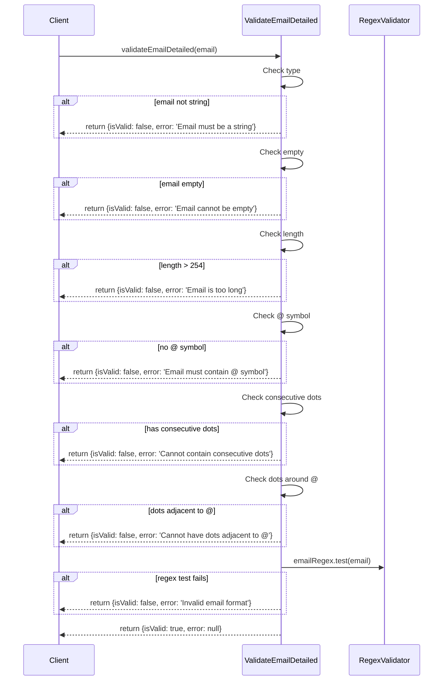
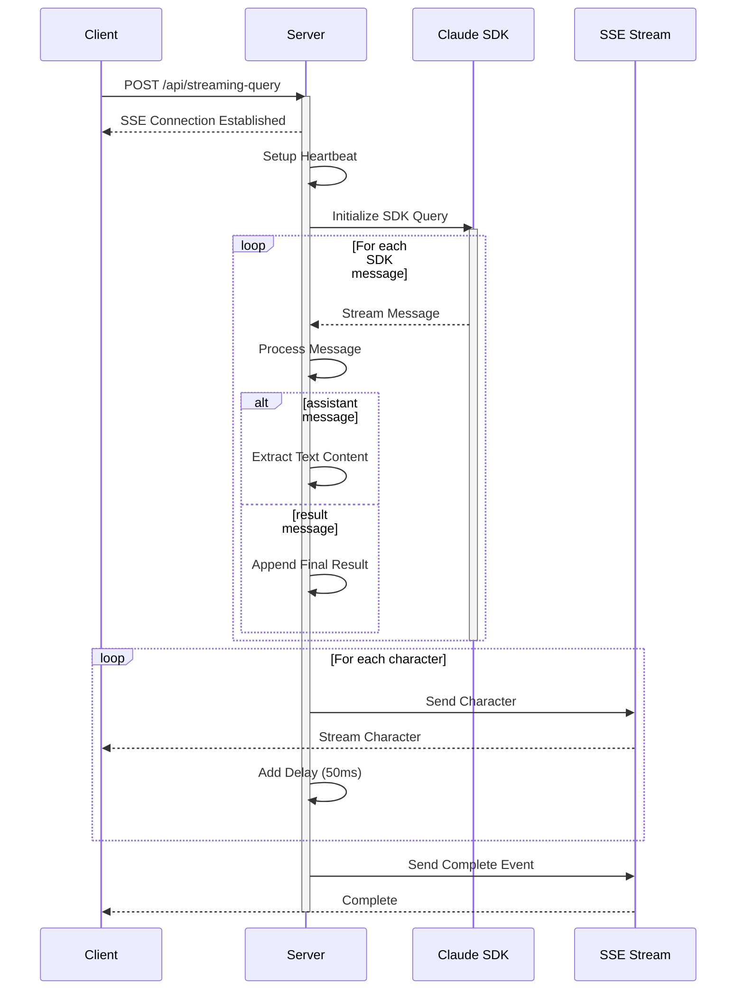

# Complex Flow Analysis - demo-real

## Email Validation Flow

### Flow Overview
- **Business Goal**: Provide robust email validation with detailed error feedback
- **Trigger Condition**: Function call to validateEmailDetailed()
- **Core Concerns**: 
  - Email format correctness
  - Length constraints
  - Special character handling
- **Key Non-functional Points**:
  - Input validation
  - Detailed error reporting
  - Performance (regex optimization)

### Sequence Diagram

### Key Configuration Items
- Email regex pattern: `/^[a-zA-Z0-9._%+-]+@[a-zA-Z0-9.-]+\.[a-zA-Z]{2,}$/`
- Maximum email length: 254 characters

### Detailed Step Analysis
1. **Type Validation**
   - Checks if input is string type
   - Returns early with error for non-string input

2. **Empty Check**
   - Validates email string is not empty
   - Returns specific error message for empty input

3. **Length Validation**
   - Enforces 254 character limit
   - Industry standard maximum length enforcement

4. **Special Character Checks**
   - Validates @ symbol presence
   - Checks for invalid dot patterns
   - Prevents consecutive dots
   - Prevents dots adjacent to @ symbol

5. **Regex Pattern Validation**
   - Final comprehensive format check
   - Validates local part and domain format
   - Ensures valid TLD length

## Real-time Streaming Query Flow

### Flow Overview
- **Business Goal**: Provide real-time streaming responses for Claude Code SDK queries
- **Trigger Condition**: HTTP POST/GET to /api/streaming-query
- **Core Concerns**: 
  - Real-time data streaming
  - Connection management
  - Error handling
- **Key Non-functional Points**:
  - Connection stability
  - Response latency
  - Resource management

### Sequence Diagram

### Key Configuration Items
- Server Port: `process.env.PORT || 3002`
- Streaming delay: 50ms per character
- Heartbeat interval: 30,000ms (30 seconds)
- Message types: 'assistant', 'result', 'error', 'heartbeat'

### Detailed Step Analysis
1. **Connection Initialization**
   - Sets SSE headers
   - Establishes persistent connection
   - Sends initial connection confirmation
   - Starts heartbeat interval

2. **Query Configuration**
   - Validates required prompt parameter
   - Processes optional parameters:
     - allowedTools
     - permissionMode
     - cwd

3. **Claude SDK Integration**
   - Initializes SDK with configuration
   - Processes messages asynchronously
   - Handles different message types:
     - Assistant messages: extracts text content
     - Result messages: appends final content

4. **Streaming Response**
   - Character-by-character transmission
   - Includes position and metadata
   - Implements artificial delay for readability
   - Maintains connection with heartbeat

5. **Error Handling & Cleanup**
   - Catches and processes SDK errors
   - Cleans up heartbeat interval
   - Sends detailed error information
   - Ensures proper connection closure