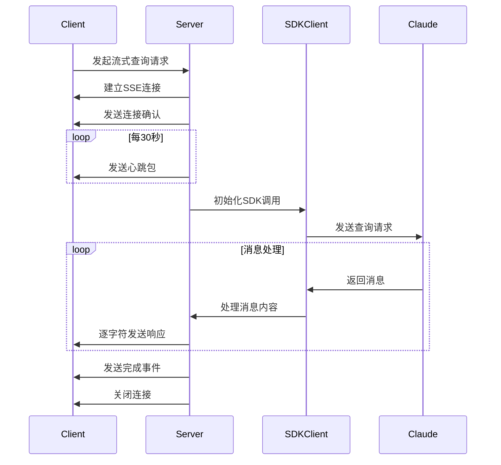
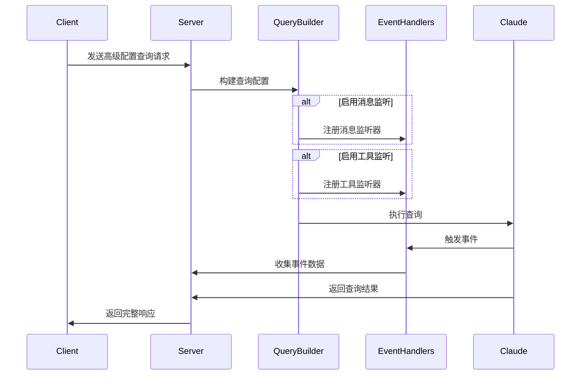
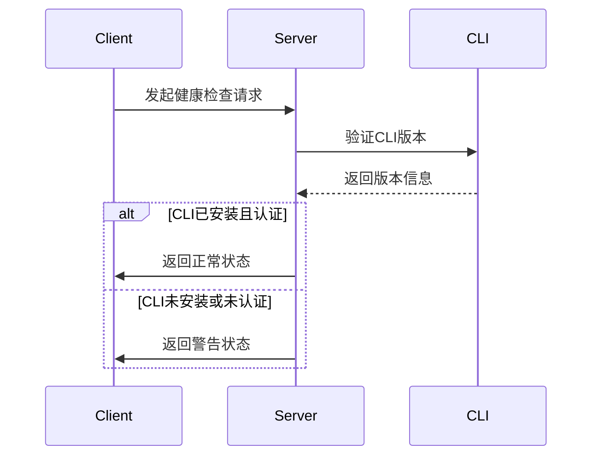

# cc-sdk-demo 复杂流程深度分析

## 1. 流式查询处理流程

### 流程概述
- **业务目标**: 提供实时的流式响应机制，支持长文本生成和实时反馈
- **触发条件**: 客户端通过 `/api/streaming-query` 发起GET或POST请求
- **潜在核心问题**: 连接稳定性、响应延迟、内存管理
- **关键非功能点**: 性能、可靠性、实时性

### Mermaid时序图

### 关键配置项
- `allowedTools`: 允许使用的工具列表
- `permissionMode`: 权限模式设置
- `heartbeatInterval`: 心跳包间隔(30秒)
- `streamDelay`: 字符流发送延迟(50ms)

### 详细步骤分析
1. **连接建立**
   - 设置SSE响应头
   - 发送初始连接确认
   - 启动心跳机制

2. **SDK调用处理**
   - 验证必要参数
   - 初始化SDK配置
   - 收集响应消息
   - 处理不同类型的消息(assistant/result)

3. **流式响应发送**
   - 清理响应文本
   - 逐字符发送处理
   - 添加延迟模拟真实效果
   - 发送完成事件

4. **错误处理机制**
   - 连接异常处理
   - 心跳清理
   - 详细错误信息返回

## 2. 高级配置查询流程

### 流程概述
- **业务目标**: 提供灵活的查询配置和事件监听机制
- **触发条件**: 通过 `/api/advanced-query` 发起POST请求
- **潜在核心问题**: 配置验证、事件处理效率
- **关键非功能点**: 可配置性、可监控性

### Mermaid时序图

### 关键配置项
- `model`: Claude模型配置
- `timeout`: 查询超时设置
- `allowedTools`: 允许的工具列表
- `enableMessageListener`: 消息监听开关
- `enableToolListener`: 工具使用监听开关

### 详细步骤分析
1. **配置构建**
   - 验证必要参数
   - 应用高级配置选项
   - 配置事件监听器

2. **查询执行**
   - 使用Fluent API构建查询
   - 执行查询并获取原始结果
   - 过滤处理响应内容

3. **事件处理**
   - 收集消息事件
   - 记录工具使用事件
   - 合并事件数据

4. **结果返回**
   - 格式化响应数据
   - 包含事件信息
   - 错误处理和状态返回

## 3. CLI认证和健康检查流程

### 流程概述
- **业务目标**: 验证系统健康状态和CLI工具认证
- **触发条件**: 通过 `/api/health` 和 `/api/auth-check` 发起请求
- **潜在核心问题**: CLI工具可用性、认证状态维护
- **关键非功能点**: 系统可靠性、安全性

### Mermaid时序图

### 关键配置项
- `cli_version`: CLI版本要求
- `healthcheck_interval`: 健康检查间隔
- `auth_timeout`: 认证超时设置

### 详细步骤分析
1. **健康状态检查**
   - 验证服务器状态
   - 检查环境配置
   - 确认服务可用性

2. **CLI工具验证**
   - 检查CLI安装状态
   - 验证版本兼容性
   - 确认认证状态

3. **状态报告生成**
   - 聚合检查结果
   - 格式化状态信息
   - 生成详细报告