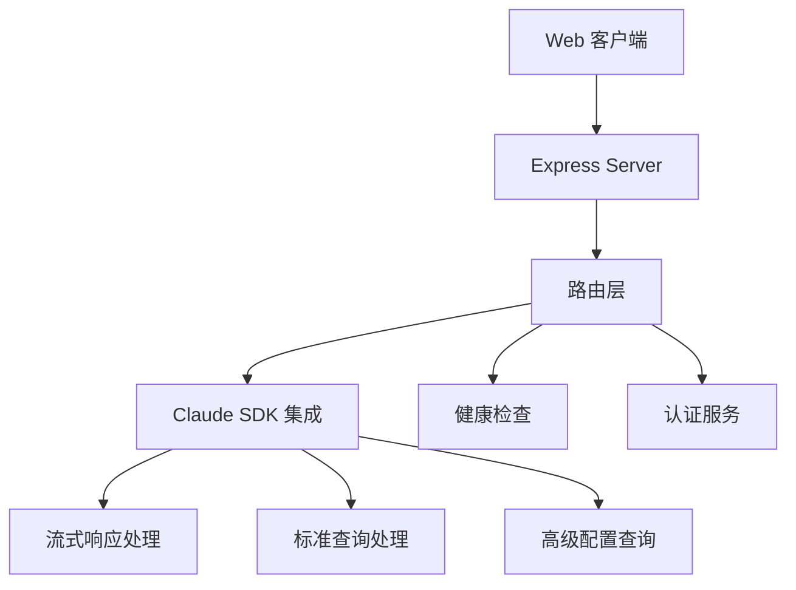
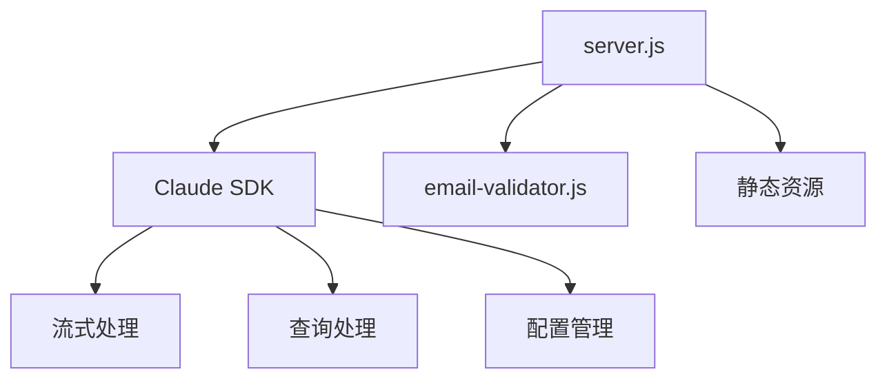
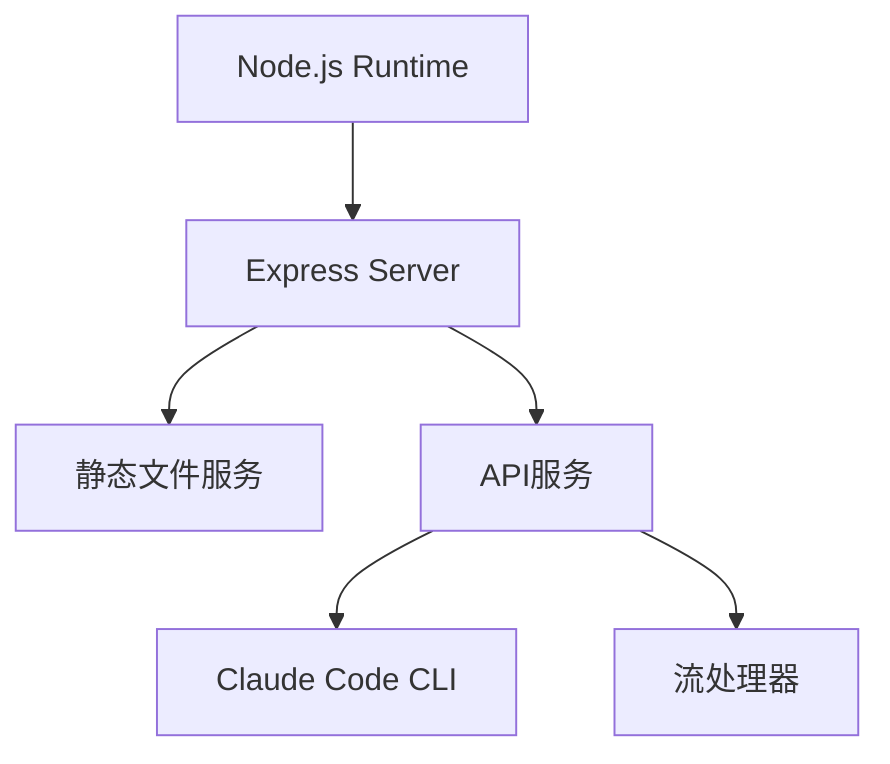
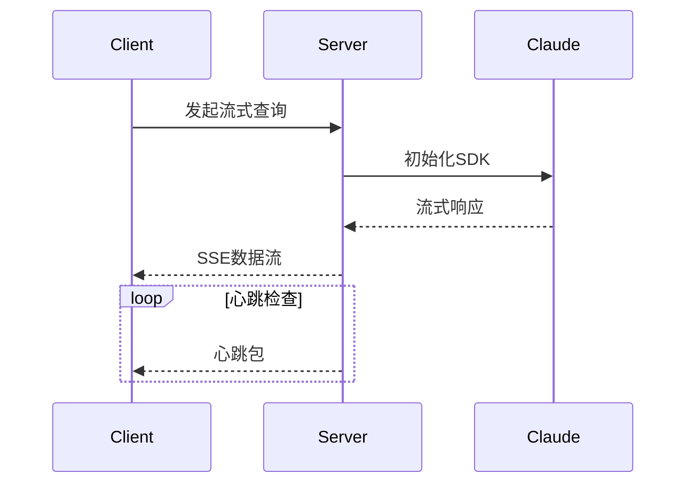
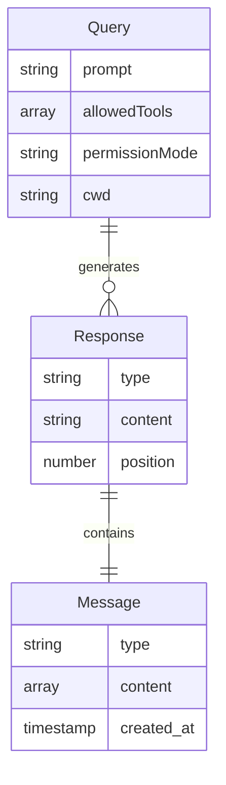

# Demo Real Technical Overview

## Part A: 项目概述

### 项目背景与使命
Demo Real 是一个基于 Express.js 构建的现代化服务器端应用，主要用于演示 Claude Code SDK 的流式响应和高级 API 功能。项目致力于提供一个稳定、高性能的服务端环境，支持实时数据流和 Claude AI 交互。该项目作为 Claude Code SDK 的示例实现，展示了：

1. 流式响应的最佳实践实现
2. Claude Code CLI 的集成方案
3. 高级配置和权限管理的使用方式

### 主要用户角色与场景
1. **开发者**
   - 学习 Claude Code SDK 的使用方法
   - 测试和验证 SDK 功能
   - 参考流式响应的实现方式

2. **集成工程师**
   - 评估 SDK 性能和可靠性
   - 测试不同配置选项
   - 进行系统集成验证

## Part B: 技术栈详解

| 类别 | 技术组件 | 版本 | 用途 |
|------|----------|------|------|
| 运行时 | Node.js | ES Modules | 服务器运行环境 |
| 框架 | Express.js | ^4.18.2 | Web 服务器框架 |
| HTTP | Cors | ^2.8.5 | 跨域资源共享 |
| 网络 | Axios | ^1.11.0 | HTTP 客户端 |
| CLI工具 | Claude Code CLI | - | AI 能力支持 |

## Part C: 架构五视图分析

### 1. 逻辑视图

系统的主要功能模块围绕Claude SDK集成展开，通过Express Server提供Web API接口，支持多种查询模式和认证管理。

### 2. 开发视图

代码组织清晰，核心逻辑集中在server.js，辅助功能模块化，便于维护和扩展。

### 3. 部署视图

采用单体架构，依赖Node.js运行时和Claude Code CLI，部署简单直接。

### 4. 运行视图

流式响应机制通过SSE实现，保持长连接并通过心跳维护会话活性。

### 5. 数据视图

## Part D: 核心复杂流程识别表

| 流程名称 | 流程入口函数 | 核心复杂性解释 | 潜在问题 | 重要程度 |
|---------|-------------|---------------|----------|----------|
| 流式响应处理 | handleStreamingQuery | 管理流式数据传输和错误恢复 | 连接断开、内存泄漏 | 高 |
| CLI认证检查 | /api/auth-check | 验证CLI工具状态和认证 | CLI安装异常 | 高 |
| 高级查询配置 | /api/advanced-query | 处理复杂配置参数 | 参数验证不完整 | 中 |
| 邮箱验证 | validateEmailDetailed | 多规则验证和错误处理 | 验证规则更新 | 低 |
| 心跳维护 | setInterval | 维护SSE连接活性 | 资源占用过高 | 中 |
| SDK消息处理 | query函数内部 | 解析和转换消息格式 | 消息解析错误 | 高 |
| 错误处理中间件 | app.use(error) | 统一错误处理逻辑 | 错误分类不明确 | 中 |
| 状态监控 | /api/health | 服务健康检查 | 状态报告不准确 | 中 |