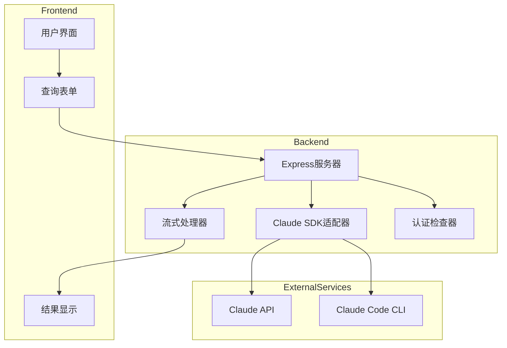
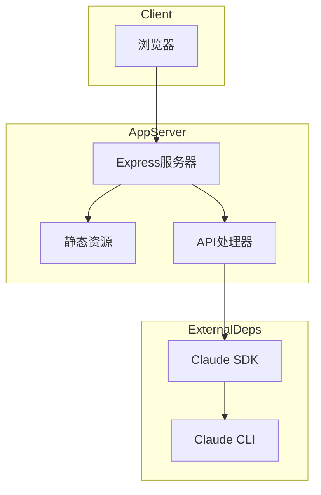
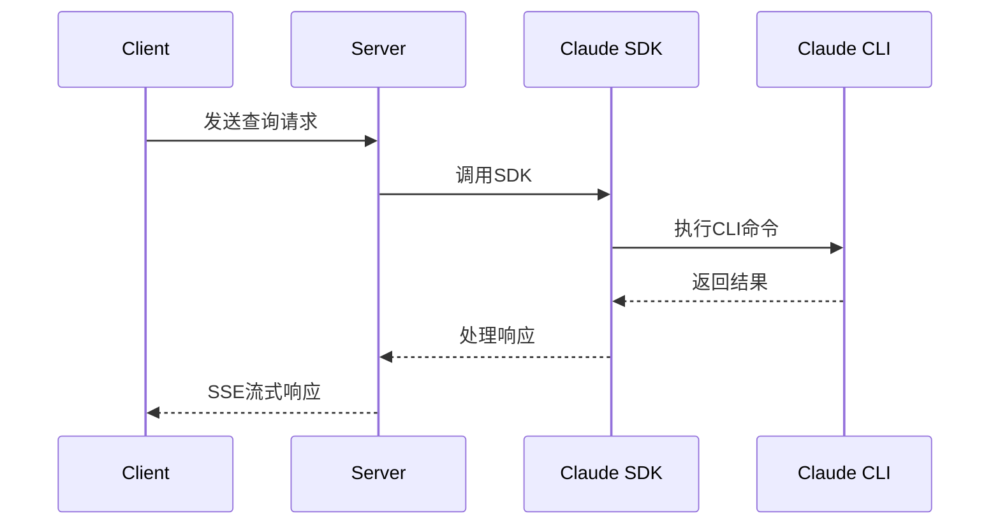
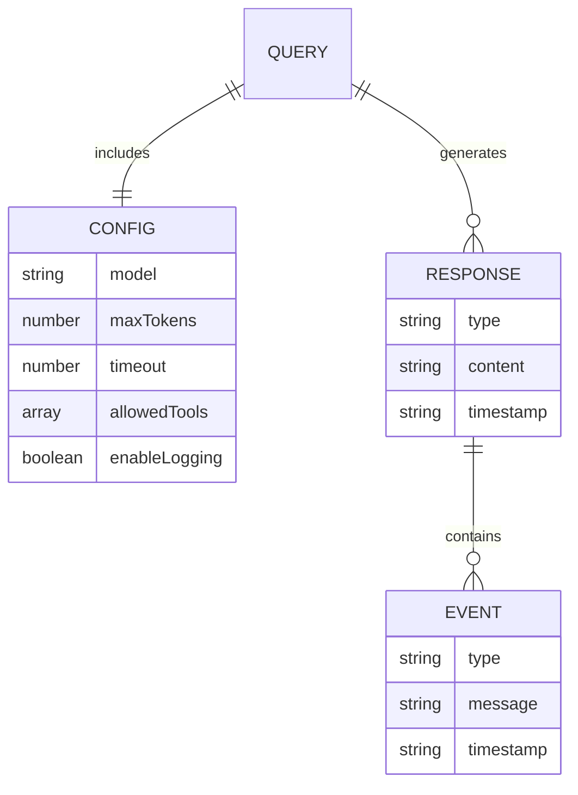

# demo-real 项目技术总览

## Part A: 项目概述

### 项目背景与使命

demo-real是一个Claude Code SDK的演示项目，旨在展示如何使用Claude的AI能力进行代码开发和分析。项目提供了一个完整的Web界面，用于演示Claude Code SDK的各种功能，包括：

1. 基础查询能力 - 通过SDK进行基本的AI对话
2. 代码分析功能 - 分析代码质量和提供改进建议
3. 文件操作能力 - 演示文件读写和代码生成
4. 流式响应处理 - 实时展示AI生成的内容
5. 高级配置选项 - 支持自定义SDK行为

项目的核心价值在于为开发者提供一个实际的使用案例，展示如何将Claude的AI能力集成到开发工作流程中。

### 主要用户角色与场景

1. **开发者**
   - 体验Claude Code SDK的基本功能
   - 了解如何集成Claude到开发环境
   - 测试不同的API调用方式

2. **技术评估人员**
   - 评估Claude Code SDK的技术能力
   - 测试API的性能和可靠性
   - 分析集成成本和可行性

## Part B: 技术栈详解

| 类别 | 组件 | 版本 | 用途 |
|------|------|------|------|
| **编程语言** | JavaScript (ES Modules) | ES2022 | 主要开发语言 |
| **前端** | HTML5 + CSS3 | - | Web界面开发 |
| **后端框架** | Express | ^4.18.2 | Web服务器 |
| **HTTP客户端** | Axios | ^1.11.0 | API请求处理 |
| **跨域中间件** | CORS | ^2.8.5 | 跨域资源共享 |
| **进程管理** | execa | - | CLI命令执行 |
| **运行时** | Node.js | - | 运行环境 |
| **通信协议** | SSE | - | 服务器推送 |

## Part C: 架构五视图分析

### 1. 逻辑视图



系统采用前后端分离架构，前端通过表单发送请求，后端处理请求并与Claude API交互，通过流式处理返回结果。认证检查器确保CLI工具的正确配置。

### 2. 开发视图

```mermaid
graph LR
    subgraph CoreFiles
        Server[server.js]
        EmailValidator[email-validator.js]
        DemoUI[simple-real-demo.html]
    end
    
    subgraph Config
        Package[package.json]
        Scripts[/*.sh]
    end
    
    subgraph Static
        HTML[*.html]
        JS[*.js]
    end
    
    Server --> EmailValidator
    Server --> DemoUI
    Package --> Server
    Scripts --> Server
    HTML --> JS
```

代码结构清晰，主要分为：
- 核心服务器文件(server.js)
- 工具函数(email-validator.js)
- 前端界面(simple-real-demo.html)
- 配置文件(package.json)
- 辅助脚本(*.sh)

### 3. 部署视图



采用简单的客户端-服务器部署模式：
- 浏览器访问Express服务器
- 服务器提供静态资源和API服务
- 通过SDK与Claude CLI交互

### 4. 运行视图



系统运行时采用异步处理模式：
1. 客户端发送查询请求
2. 服务器通过SDK调用CLI
3. 处理响应并通过SSE推送
4. 保持连接直到响应完成

### 5. 数据视图



数据结构主要包括：
- 查询配置(超时、工具等)
- 响应内容(类型、文本等)
- 事件记录(类型、时间戳)

## Part D: 核心复杂流程识别表

| 流程名称 | 流程入口函数 | 核心复杂性解释 | 潜在问题 | 重要程度 |
|---------|-------------|--------------|----------|----------|
| 流式响应处理 | handleStreamingQuery | 维护SSE长连接，处理分片数据 | 连接断开、内存泄漏 | 高 |
| Claude认证检查 | /api/auth-check | 验证CLI安装和认证状态 | CLI未安装、认证失败 | 高 |
| 高级查询配置 | /api/advanced-query | 处理配置和事件监听 | 配置冲突、超时 | 中 |
| 邮箱验证 | validateEmailDetailed | 多重验证规则和错误报告 | 正则性能问题 | 中 |
| SSE通信 | runStreamingQuery | 维护EventSource连接 | 浏览器兼容性 | 高 |
| 心跳机制 | handleStreamingQuery | 保持连接活跃和断开检测 | 资源未释放 | 中 |
| API配置验证 | configureAPI | 验证密钥和基础URL | 安全性问题 | 高 |
| 结果解析展示 | showResult | 处理多种响应格式 | XSS风险 | 中 |
| 错误处理 | app.use(error) | 统一错误处理和日志 | 信息泄露 | 高 |
| 工具权限控制 | handleStreamingQuery | 管理工具访问权限 | 权限提升 | 高 |