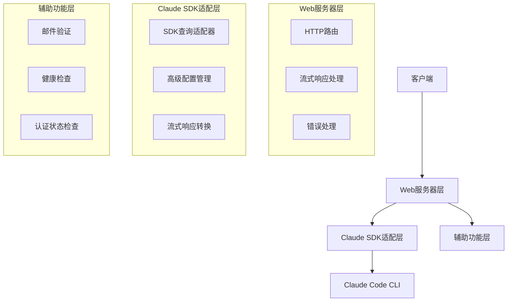
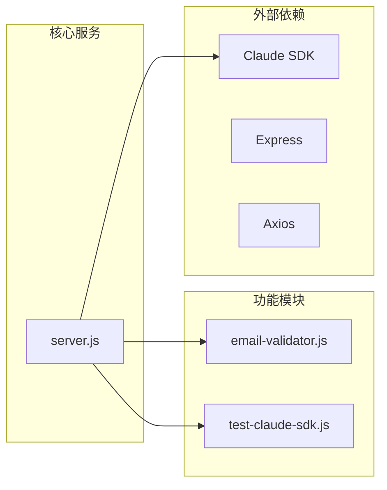
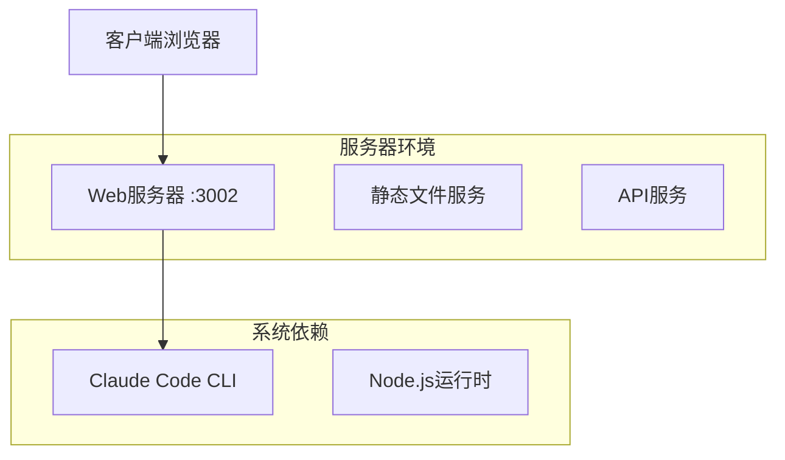
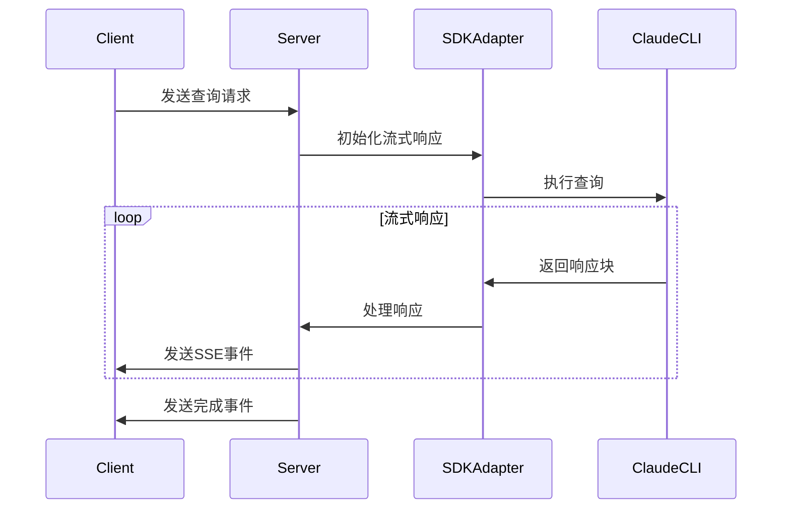
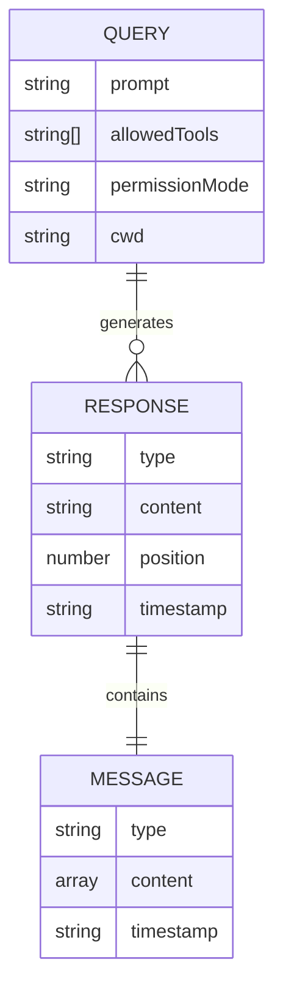

# demo-real Technical Overview

## Part A: 项目概述

### 项目背景与使命
demo-real 是一个专门为展示 Claude Code SDK 功能而设计的演示服务器。它提供了一个完整的后端服务，支持实时流式响应和 Claude SDK 的高级特性演示。项目的核心价值在于：

1. 提供实时流式响应的 Claude AI 交互体验
2. 展示 Claude Code SDK 的集成最佳实践
3. 支持开发者快速理解和测试 Claude Code SDK 的功能

### 主要用户角色与场景

1. **开发者**
   - 测试和验证 Claude Code SDK 的功能
   - 学习 SDK 集成的最佳实践
   - 开发自己的 Claude AI 应用

2. **集成工程师**
   - 评估 Claude Code SDK 的性能和可用性
   - 测试不同配置和权限模式
   - 进行系统集成测试

## Part B: 技术栈详解

### 编程语言与运行时
| 类别 | 技术 | 版本 | 用途 |
|------|------|------|------|
| 运行时 | Node.js | >= 14.x | 服务器运行环境 |
| 语言 | JavaScript (ES Modules) | ES2022 | 主要开发语言 |

### 框架与库
| 名称 | 版本 | 用途 |
|------|------|------|
| Express | 4.18.2 | Web 服务器框架 |
| Axios | 1.11.0 | HTTP 客户端 |
| CORS | 2.8.5 | 跨域资源共享 |

### 工具链
| 工具 | 用途 |
|------|------|
| npm | 包管理和脚本运行 |
| Claude Code CLI | AI 功能支持 |

## Part C: 架构五视图分析

### 1. 逻辑视图

**说明**:
- Web服务器层处理所有HTTP请求和响应
- Claude SDK适配层负责与Claude Code CLI的交互
- 辅助功能层提供支持性功能

### 2. 开发视图

**说明**:
- 采用模块化设计，功能明确分离
- 统一的错误处理和日志记录
- 清晰的依赖关系管理

### 3. 部署视图

**说明**:
- 单体服务器架构，部署简单
- 支持容器化部署
- 依赖Claude Code CLI的本地安装

### 4. 运行视图

**说明**:
- 采用SSE实现流式响应
- 异步处理所有请求
- 心跳机制保持连接活跃

### 5. 数据视图

**说明**:
- 主要数据流是查询请求和响应
- 无持久化存储需求
- 内存中的消息队列处理

## Part D: 核心复杂流程识别表

| 流程名称 | 流程入口函数 | 核心复杂性解释 | 潜在问题 | 重要程度 |
|---------|------------|--------------|----------|----------|
| 流式查询处理 | handleStreamingQuery | 管理长连接和流式响应 | 连接中断处理 | 高 |
| CLI认证检查 | /api/auth-check | 验证Claude CLI状态 | CLI更新兼容性 | 高 |
| 高级查询配置 | /api/advanced-query | 动态配置SDK参数 | 参数验证复杂性 | 中 |
| 邮件验证 | validateEmailDetailed | 多重规则验证 | 规则维护 | 低 |
| 响应流控制 | sendTextStream | 控制响应速率 | 性能与延迟平衡 | 中 |
| SDK消息处理 | test-claude-sdk.js | 解析和转换消息格式 | 消息格式变更 | 高 |
| 错误处理链 | app.use(error) | 统一错误处理和日志 | 错误分类和恢复 | 中 |
| 心跳维护 | setInterval | 保持流式连接活跃 | 资源消耗 | 中 |