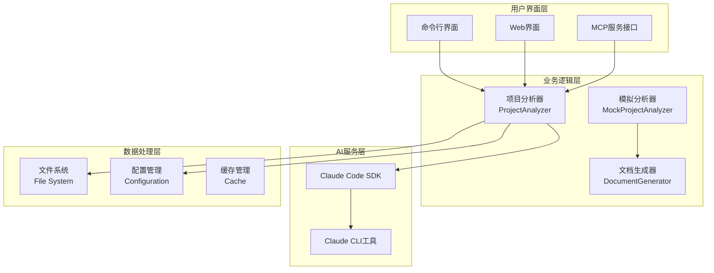
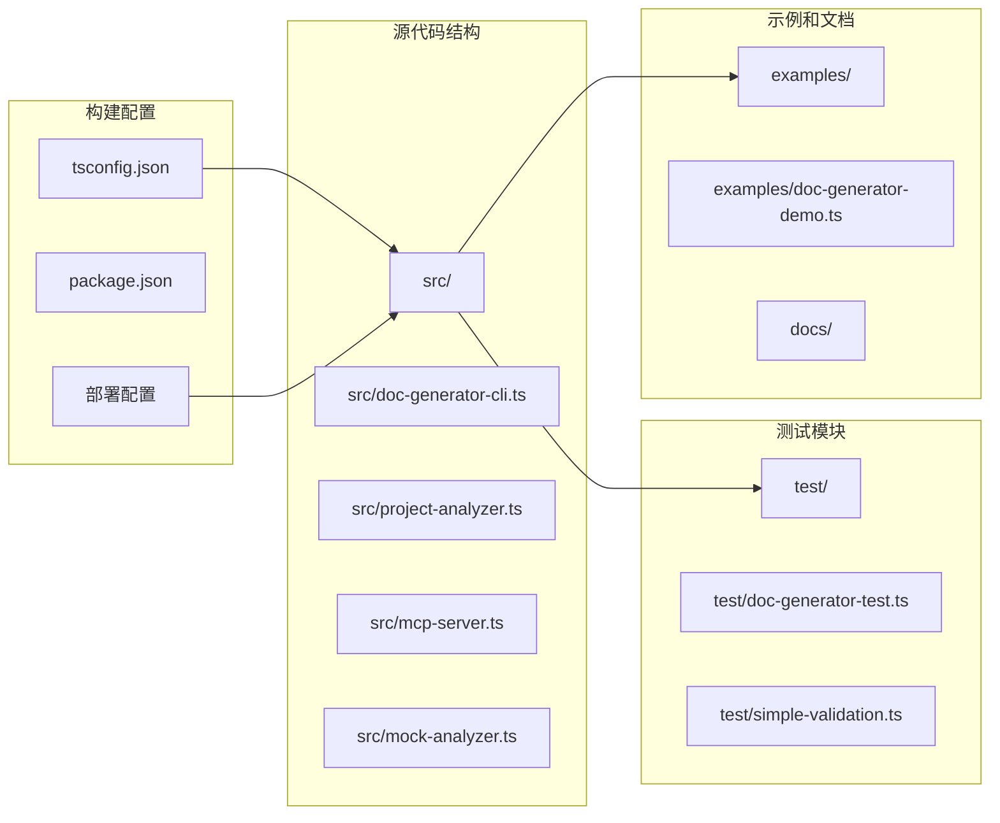
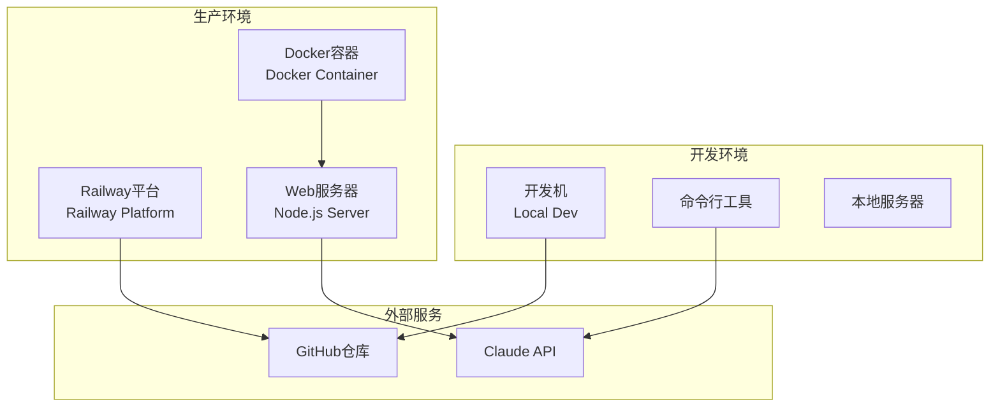
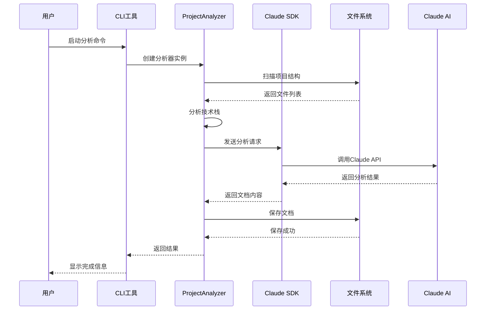
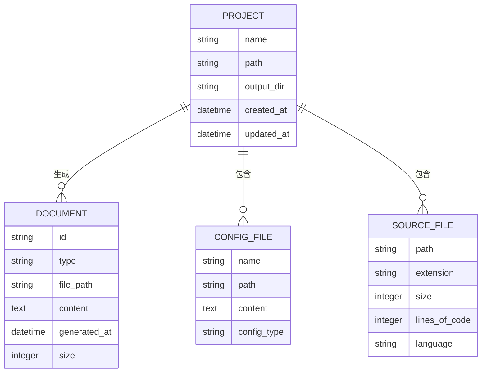

# Doc-Generator-Tool 技术总览

## 项目概述

**Doc-Generator-Tool** 是一个基于 Claude Code SDK 的智能项目文档生成工具，能够自动分析代码项目并生成高质量的技术文档。该工具通过深度扫描项目结构、分析技术栈和复杂模块，为开发者提供全面的项目技术文档。

### 核心功能

- 🔍 **智能项目分析**: 自动分析项目结构、技术栈和复杂模块
- 📋 **多种文档类型**: 支持生成技术总览、复杂流程分析和问题诊断方案
- 🎯 **准确技术栈检测**: 基于文件扩展名和配置文件智能识别技术栈
- 📊 **详细架构图**: 自动生成 Mermaid 架构图和序列图
- 🔧 **灵活配置**: 支持自定义分析深度和输出格式
- 🤖 **MCP服务**: 封装为Model Context Protocol服务，供其他智能体使用
- 🔌 **多平台集成**: 支持Claude Code SDK、独立MCP客户端等多种使用方式

## 技术栈详解

### 核心技术组件

| 组件 | 版本 | 用途 |
|------|------|------|
| **TypeScript** | ES2022 | 主要开发语言，提供类型安全 |
| **Node.js** | >=18.0.0 | 运行环境 |
| **Claude Code SDK** | 0.3.3 | AI 交互核心，提供代码分析能力 |
| **MCP SDK** | 0.4.0 | Model Context Protocol 支持 |
| **fs-extra** | 11.1.1 | 增强的文件系统操作 |
| **chalk** | 4.1.2 | 终端输出美化 |

### 开发工具链

| 工具 | 版本 | 用途 |
|------|------|------|
| **TypeScript Compiler** | 5.0.0 | 代码编译和类型检查 |
| **tsx** | 4.0.0 | TypeScript 执行工具 |
| **Vitest** | - | 测试框架 |
| **ESLint** | - | 代码质量检查 |
| **Prettier** | - | 代码格式化 |

## 架构五视图分析

### 1. 逻辑视图 (Logical View)

**逻辑视图说明**: 
- 系统采用分层架构，用户界面层提供多种交互方式
- 业务逻辑层负责核心的分析和文档生成功能
- AI服务层通过Claude Code SDK提供智能分析能力
- 数据处理层管理文件系统、配置和缓存

### 2. 开发视图 (Development View)

**开发视图说明**:
- 采用模块化设计，核心功能集中在`src/`目录
- 提供完整的测试套件，包括集成测试和单元测试
- 丰富的示例代码帮助用户快速上手
- 标准化的TypeScript项目结构

### 3. 部署视图 (Deployment View)

**部署视图说明**:
- 支持本地开发环境和生产环境部署
- Railway平台提供云部署服务
- Docker容器化部署确保环境一致性
- 通过GitHub进行版本控制和持续集成

### 4. 运行视图 (Runtime View)

**运行视图说明**:
- 采用异步处理流程，支持并发分析
- 通过Claude SDK与AI服务交互
- 文件系统操作采用异步API
- 完整的错误处理和状态反馈机制

### 5. 数据视图 (Data View)

**数据视图说明**:
- 项目包含多个文档、配置文件和源文件
- 文档分为不同类型：技术总览、复杂流程分析、问题诊断
- 配置文件包括package.json、tsconfig.json等
- 源文件按扩展名分类，支持多种编程语言

## 核心复杂流程识别表

| 流程名称 | 流程入口函数 | 核心复杂性解释 | 潜在问题 | 重要程度 |
|---------|-------------|----------------|----------|----------|
| 项目结构扫描 | `scanProjectStructure()` | 递归遍历目录树，过滤排除模式，处理文件权限问题 | 大项目扫描超时、权限错误、内存占用过高 | 高 |
| 技术栈检测 | `detectTechnologies()` | 基于文件扩展名和依赖关系的多维度分析 | 检测不准确、新技术栈识别失败 | 高 |
| Claude SDK集成 | `claude().query()` | 异步AI调用，超时处理，错误重试机制 | API调用失败、网络问题、配额限制 | 高 |
| MCP服务封装 | `DocumentGeneratorMCPServer` | 协议转换、工具注册、状态管理 | 协议兼容性、并发访问问题 | 中 |
| 文档生成流程 | `generateTechnicalOverview()` | 复杂提示词构建、结果解析、文件保存 | 生成质量不稳定、格式错误 | 高 |
| 命令行参数解析 | `parseArgs()` | 多种参数格式、默认值处理、参数验证 | 参数冲突、格式错误、帮助信息不完整 | 中 |
| 交互式输入 | `interactiveInput()` | 异步输入处理、输入验证、用户体验 | 输入超时、验证失败、流程中断 | 中 |
| Web服务器 | `server.js` | 静态文件服务、MIME类型处理、安全防护 | 文件路径遍历、内存泄漏、并发处理 | 中 |
| 错误处理机制 | 全局错误处理 | 多层次错误捕获、用户友好提示、日志记录 | 错误信息丢失、调试困难 | 高 |
| 配置管理 | `mergeWithDefaults()` | 配置合并、类型验证、环境适配 | 配置冲突、默认值不当 | 中 |

## 关键技术特点

### 1. 智能分析能力
- 基于Claude AI的深度代码理解
- 自动识别项目模式和技术栈
- 生成结构化的技术文档

### 2. 多种文档类型
- **技术总览**: 项目整体架构和技术栈分析
- **复杂流程分析**: 核心业务流程的详细分析
- **问题诊断**: 潜在问题和解决方案

### 3. 灵活的部署方式
- 命令行工具直接使用
- MCP服务集成到Claude Code
- Web界面在线访问
- Railway云平台一键部署

### 4. 可扩展架构
- 模块化设计便于功能扩展
- 插件式分析器支持
- 配置驱动的文档生成

### 5. 开发友好
- 完整的TypeScript类型定义
- 丰富的示例和测试
- 详细的错误信息和调试支持

## 性能考虑

- **文件扫描优化**: 限制最大文件数量，避免大项目分析超时
- **内存管理**: 流式处理大文件，避免内存溢出
- **并发控制**: 合理控制并发分析任务数量
- **缓存机制**: 分析结果缓存，避免重复计算
- **超时处理**: Claude API调用设置合理超时时间

## 安全考虑

- **文件系统安全**: 防止路径遍历攻击
- **输入验证**: 严格验证用户输入参数
- **错误处理**: 避免敏感信息泄露
- **权限控制**: 最小权限原则访问文件系统
- **网络安全**: HTTPS通信，API密钥安全存储

## 总结

Doc-Generator-Tool 是一个功能强大、架构清晰的智能文档生成工具。它通过结合Claude AI的分析能力和现代化的软件架构，为开发者提供了高效、准确的项目文档生成解决方案。该工具的设计充分考虑了可扩展性、性能和安全性，适合在各种开发和部署环境中使用。