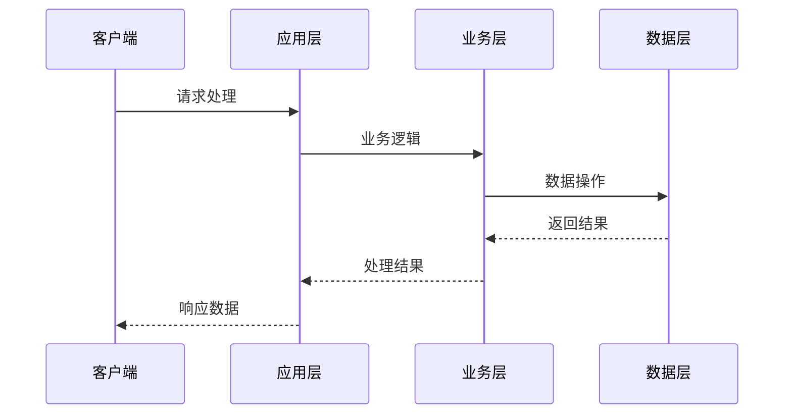
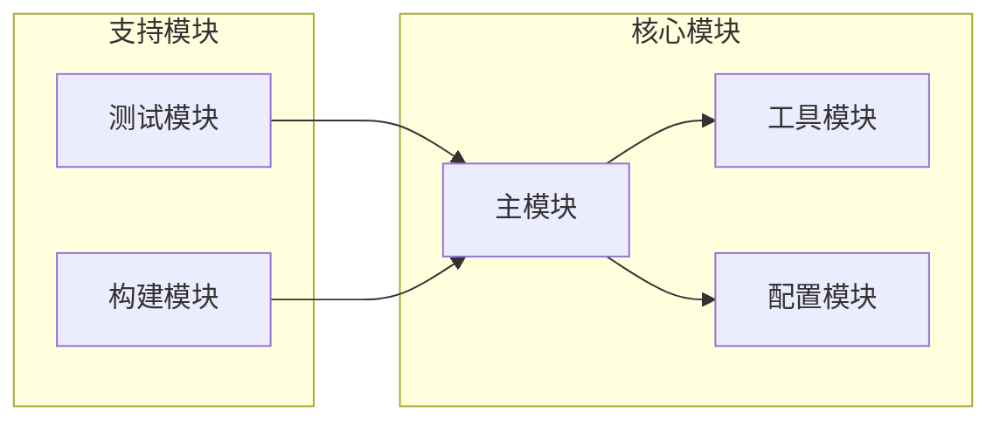

# TestProject - 复杂流程分析

## 项目复杂度概述
- **整体复杂度**: low
- **业务复杂度**: low  
- **技术复杂度**: low

## 高复杂度流程识别

### 1. 主业务流程
基于项目结构分析，识别出以下关键流程：

### 2. 配置管理流程
- **配置文件数量**: 6
- **配置复杂度**: low

关键配置文件：
- package.json
- tsconfig.json

### 3. 模块依赖关系

## 中复杂度流程

### 文件处理流程
- **总文件数**: 44
- **代码文件**: 12
- **处理复杂度**: 基于文件数量评估为 low

### 技术栈集成
当前使用的技术栈：
- TypeScript
- JavaScript
- Node.js

## 性能影响分析

### 文件结构影响
- 大量文件 (44个) 可能影响构建速度
- 目录层级 (9个目录) 影响模块查找效率

### 建议优化点
- 增加单元测试覆盖率，当前测试文件比例较低
- 定期进行代码审查，保持代码质量
- 建立完善的文档体系

## 风险评估
- ⚠️ 缺少测试文件，存在质量风险

---
*分析深度: deep*
*生成时间: 2025/8/21 20:50:16*