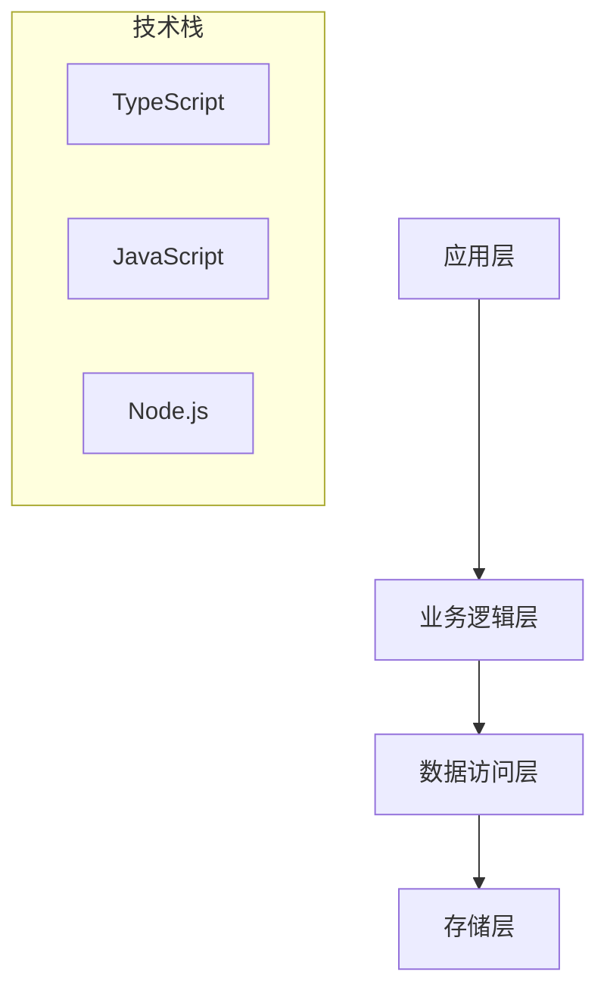

# TestProject - 技术总览

## 项目概述
- **项目名称**: TestProject
- **项目路径**: .
- **技术栈**: TypeScript, JavaScript, Node.js

## 项目结构统计
- **总文件数**: 53
- **目录数量**: 9
- **代码文件**: 14
- **测试文件**: 0
- **配置文件**: 7

## 文件类型分布
- : 3 个文件
- .md: 23 个文件
- .ts: 11 个文件
- .sh: 3 个文件
- .html: 3 个文件
- .json: 7 个文件
- .js: 3 个文件

## 复杂度评估
- **整体复杂度**: low
- **业务复杂度**: low
- **技术复杂度**: low

## 关键文件
- README.md
- package.json
- tsconfig.json
- server.js

## 架构视图

## 改进建议
- 增加单元测试覆盖率，当前测试文件比例较低
- 定期进行代码审查，保持代码质量
- 建立完善的文档体系

## 潜在问题
- 缺少测试文件，存在质量风险

---
*文档生成时间: 2025/8/21 21:07:36*
*分析工具: Claude Code 文档生成器 (模拟模式)*