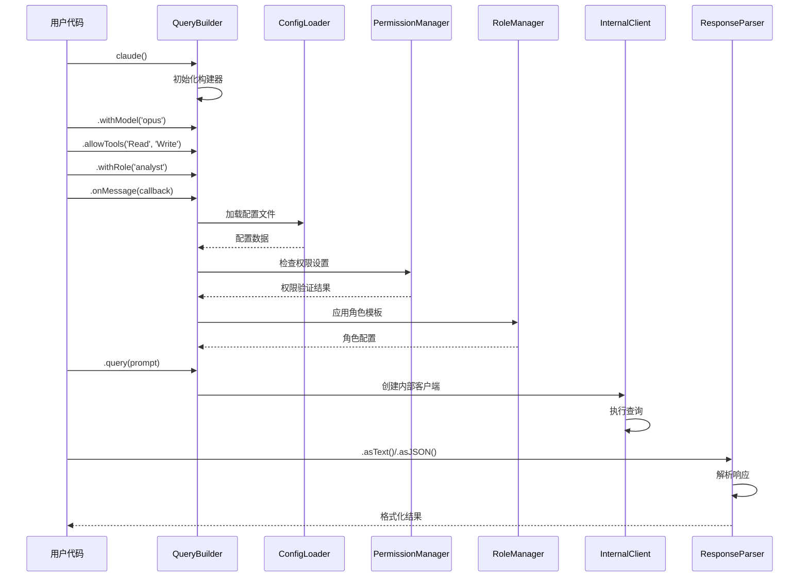
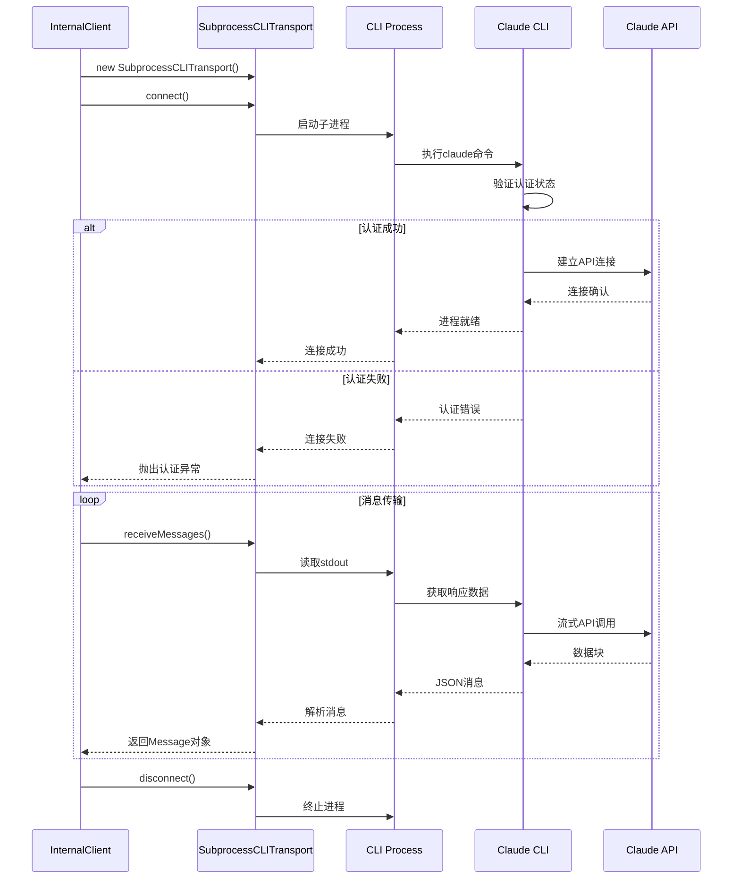
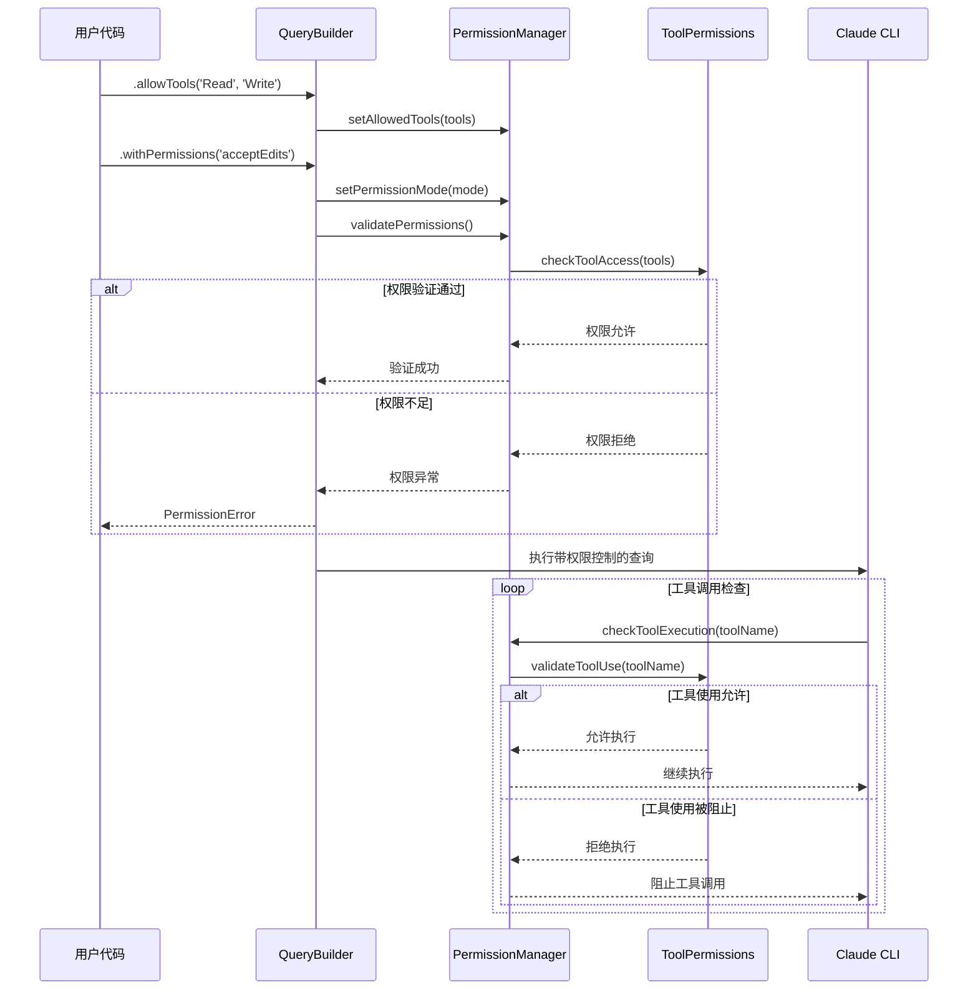
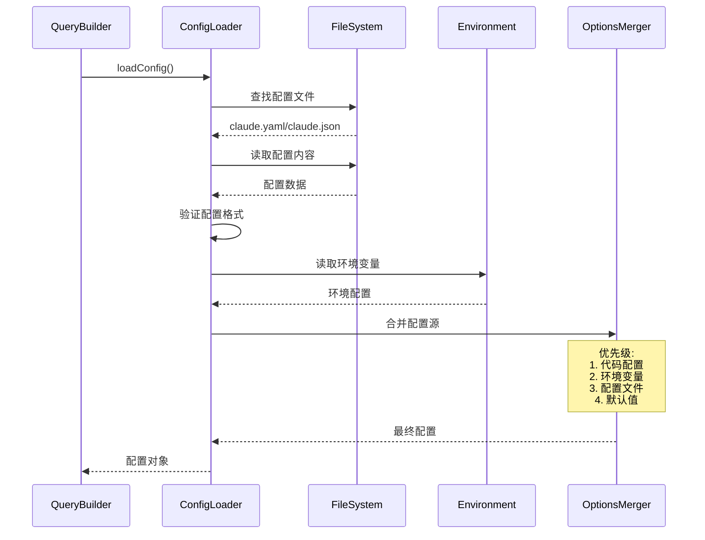
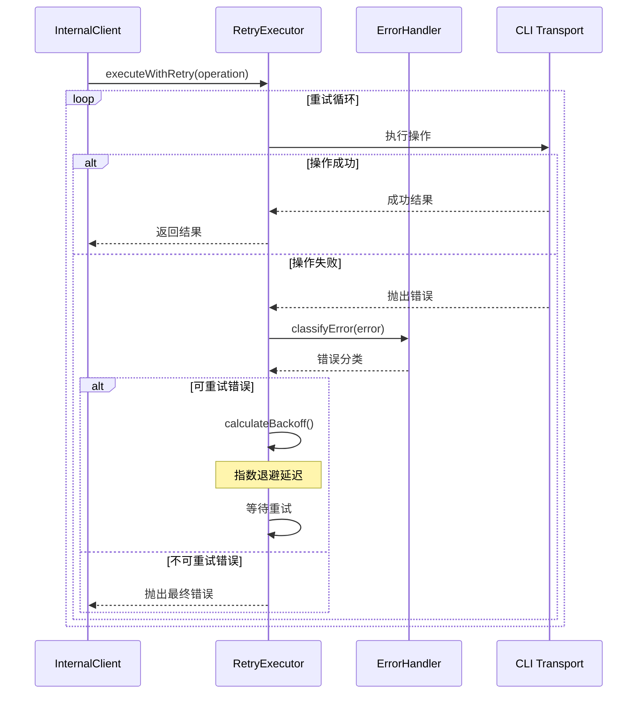

# cc-sdk-demo 复杂流程分析

## 概述

本文档深入分析 **cc-sdk-demo** 项目中的核心复杂流程，重点关注双API设计、CLI通信机制、权限管理系统和配置加载流程。通过详细的流程分析，帮助开发者理解系统的内部工作机制和关键技术实现。

---

## 1. 流式API查询构建流程 (Fluent API Query Building)

### 流程概述
**复杂度**: 高 | **重要程度**: 核心 | **文件**: `src/fluent.ts:34-500+`

流式API查询构建是项目的核心创新，通过链式方法构建复杂的Claude查询配置，支持权限管理、角色模板、事件监听等高级功能。

### 序列图


### 关键配置项
| 配置项 | 类型 | 默认值 | 说明 |
|--------|------|--------|------|
| `model` | String | undefined | Claude模型选择 |
| `timeout` | Number | 300000 | 请求超时时间(ms) |
| `allowedTools` | Array | undefined | 允许的工具列表 |
| `permissionMode` | String | undefined | 权限模式设置 |
| `cwd` | String | process.cwd() | 工作目录路径 |
| `maxRetries` | Number | 3 | 最大重试次数 |

### 详细流程步骤

#### 步骤1: 查询构建器初始化 (fluent.ts:44-48)
```typescript
constructor() {
  this.permissionManager = new PermissionManager();
  this.configLoader = new ConfigLoader();
  this.roleManager = new RoleManager();
}
```

#### 步骤2: 链式配置方法 (fluent.ts:50-200)
```typescript
// 模型配置
withModel(model: string): QueryBuilder {
  this.options.model = model;
  return this;
}

// 工具权限配置
allowTools(...tools: ToolName[]): QueryBuilder {
  this.options.allowedTools = tools;
  return this;
}

// 角色配置
withRole(roleName: string, variables?: Record<string, string>): QueryBuilder {
  this.rolePromptingTemplate = this.roleManager.getPromptTemplate(roleName);
  this.roleTemplateVariables = variables;
  return this;
}
```

#### 步骤3: 事件监听器配置 (fluent.ts:300-350)
```typescript
onMessage(handler: (message: Message) => void): QueryBuilder {
  this.messageHandlers.push(handler);
  return this;
}

onToolUse(handler: (toolExecution: any) => void): QueryBuilder {
  // 工具使用事件监听
  this.options.onToolUse = handler;
  return this;
}
```

#### 步骤4: 查询执行与响应处理 (fluent.ts:400-500)
```typescript
query(prompt: string): ResponseParser {
  // 合并所有配置选项
  const finalOptions = this.mergeOptions();
  
  // 应用角色模板
  const finalPrompt = this.applyRoleTemplate(prompt);
  
  // 创建内部客户端
  const client = new InternalClient(finalPrompt, finalOptions);
  
  // 返回响应解析器
  return new ResponseParser(client.processQuery(), this.messageHandlers);
}
```

---

## 2. CLI通信机制流程 (CLI Communication Mechanism)

### 流程概述
**复杂度**: 高 | **重要程度**: 核心 | **文件**: `src/_internal/transport/subprocess-cli.ts`

CLI通信机制负责与Claude Code CLI进程的交互，处理进程启动、消息传输、错误处理和连接管理。

### 序列图


### 关键配置项
| 配置项 | 默认值 | 说明 |
|--------|--------|------|
| `processTimeout` | 300000ms | 进程启动超时 |
| `maxBufferSize` | 1MB | 缓冲区大小限制 |
| `retryAttempts` | 3 | CLI调用重试次数 |
| `abortSignal` | undefined | 取消信号控制 |

### 详细流程步骤

#### 步骤1: 进程启动与连接 (subprocess-cli.ts:20-50)
```typescript
async connect(): Promise<void> {
  try {
    // 构建CLI命令参数
    const args = this.buildCLIArgs();
    
    // 启动子进程
    this.process = execa('claude', args, {
      stdio: ['pipe', 'pipe', 'pipe'],
      cwd: this.options.cwd,
      timeout: this.options.timeout
    });
    
    // 等待进程就绪
    await this.waitForReady();
    
  } catch (error) {
    throw this.handleConnectionError(error);
  }
}
```

#### 步骤2: 消息接收与解析 (subprocess-cli.ts:60-120)
```typescript
async *receiveMessages(): AsyncGenerator<CLIOutput> {
  if (!this.process) {
    throw new Error('CLI进程未启动');
  }
  
  const readline = createInterface({
    input: this.process.stdout,
    crlfDelay: Infinity
  });
  
  try {
    for await (const line of readline) {
      if (line.trim()) {
        try {
          const message = JSON.parse(line);
          yield this.validateMessage(message);
        } catch (parseError) {
          console.warn('JSON解析失败:', line);
        }
      }
    }
  } finally {
    readline.close();
  }
}
```

#### 步骤3: 错误处理与重连 (subprocess-cli.ts:130-180)
```typescript
private handleConnectionError(error: any): Error {
  // 检测错误类型
  if (error.code === 'ENOENT') {
    return new CLINotFoundError('Claude CLI未找到，请确认已正确安装');
  }
  
  if (error.exitCode === 1) {
    return new AuthenticationError('Claude CLI认证失败，请运行: claude login');
  }
  
  if (error.signal === 'SIGTERM') {
    return new TimeoutError('CLI调用超时');
  }
  
  return new CLIError(`CLI调用失败: ${error.message}`);
}
```

---

## 3. 权限管理系统流程 (Permission Management System)

### 流程概述
**复杂度**: 中 | **重要程度**: 重要 | **文件**: `src/permissions/manager.ts`

权限管理系统提供细粒度的工具访问控制，支持动态权限模式切换和安全的权限提升机制。

### 序列图


### 关键配置项
| 配置项 | 类型 | 说明 |
|--------|------|------|
| `allowedTools` | ToolName[] | 明确允许的工具列表 |
| `deniedTools` | ToolName[] | 明确禁止的工具列表 |
| `permissionMode` | PermissionMode | 权限验证模式 |
| `autoApprove` | boolean | 自动批准工具使用 |
| `strictMode` | boolean | 严格权限检查模式 |

### 详细流程步骤

#### 步骤1: 权限配置设置 (permissions/manager.ts:20-60)
```typescript
class PermissionManager {
  private allowedTools: Set<ToolName> = new Set();
  private permissionMode: PermissionMode = 'default';
  
  setAllowedTools(tools: ToolName[]): void {
    this.allowedTools.clear();
    tools.forEach(tool => this.allowedTools.add(tool));
  }
  
  setPermissionMode(mode: PermissionMode): void {
    this.permissionMode = mode;
    this.validateModeCompatibility();
  }
}
```

#### 步骤2: 权限验证逻辑 (permissions/manager.ts:70-120)
```typescript
validatePermissions(): PermissionValidationResult {
  const errors: string[] = [];
  
  // 检查工具兼容性
  if (!this.checkToolCompatibility()) {
    errors.push('工具列表包含不兼容的组合');
  }
  
  // 检查权限模式有效性
  if (!this.isValidPermissionMode()) {
    errors.push(`无效的权限模式: ${this.permissionMode}`);
  }
  
  // 检查安全限制
  if (!this.checkSecurityConstraints()) {
    errors.push('权限配置违反安全约束');
  }
  
  return {
    isValid: errors.length === 0,
    errors,
    warnings: this.getWarnings()
  };
}
```

---

## 4. 配置加载与合并流程 (Configuration Loading and Merging)

### 流程概述
**复杂度**: 中 | **重要程度**: 重要 | **文件**: `src/config/loader.ts`

配置加载系统支持多源配置文件处理，包括YAML/JSON格式、环境变量集成和配置优先级管理。

### 序列图


### 关键配置项
| 配置文件 | 优先级 | 格式 | 位置 |
|----------|--------|------|------|
| `claude.yaml` | 高 | YAML | 项目根目录 |
| `claude.json` | 中 | JSON | 项目根目录 |
| `环境变量` | 高 | 键值对 | 系统环境 |
| `默认配置` | 低 | 对象 | 代码内置 |

### 详细流程步骤

#### 步骤1: 配置文件发现 (config/loader.ts:20-50)
```typescript
class ConfigLoader {
  private configPaths = [
    'claude.yaml',
    'claude.yml', 
    'claude.json',
    '.claude.yaml',
    '.claude.json'
  ];
  
  async findConfigFile(): Promise<string | null> {
    for (const path of this.configPaths) {
      try {
        await fs.access(path);
        return path;
      } catch {
        continue;
      }
    }
    return null;
  }
}
```

#### 步骤2: 配置解析与验证 (config/loader.ts:60-120)
```typescript
async loadConfig(): Promise<ClaudeCodeOptions> {
  const configFile = await this.findConfigFile();
  let fileConfig = {};
  
  if (configFile) {
    const content = await fs.readFile(configFile, 'utf-8');
    
    if (configFile.endsWith('.yaml') || configFile.endsWith('.yml')) {
      fileConfig = yaml.load(content) as object;
    } else if (configFile.endsWith('.json')) {
      fileConfig = JSON.parse(content);
    }
    
    // 验证配置格式
    this.validateConfig(fileConfig);
  }
  
  // 加载环境变量配置
  const envConfig = this.loadEnvironmentConfig();
  
  // 合并配置
  return this.mergeConfigs(fileConfig, envConfig);
}
```

---

## 5. 错误处理与重试流程 (Error Handling and Retry)

### 流程概述
**复杂度**: 中 | **重要程度**: 重要 | **文件**: `src/retry/executor.ts, src/errors/enhanced.ts`

智能错误处理与重试系统提供分类错误处理、指数退避重试和错误恢复机制。

### 序列图


### 关键配置项
| 配置项 | 默认值 | 说明 |
|--------|--------|------|
| `maxRetries` | 3 | 最大重试次数 |
| `baseDelay` | 1000ms | 基础延迟时间 |
| `maxDelay` | 30000ms | 最大延迟时间 |
| `backoffFactor` | 2 | 退避倍数因子 |
| `jitter` | true | 随机抖动开关 |

### 详细流程步骤

#### 步骤1: 错误分类识别 (errors/enhanced.ts:20-80)
```typescript
function classifyError(error: Error): ErrorClassification {
  const errorPatterns = {
    AUTHENTICATION: /authentication|login|unauthorized/i,
    NETWORK: /network|connection|timeout/i,
    PERMISSION: /permission|forbidden|access denied/i,
    RATE_LIMIT: /rate limit|too many requests/i,
    RESOURCE: /memory|disk space|resource/i
  };
  
  for (const [type, pattern] of Object.entries(errorPatterns)) {
    if (pattern.test(error.message)) {
      return {
        type: type as ErrorType,
        retryable: RETRYABLE_ERRORS.includes(type),
        priority: ERROR_PRIORITIES[type]
      };
    }
  }
  
  return { type: 'UNKNOWN', retryable: false, priority: 'low' };
}
```

#### 步骤2: 智能重试策略 (retry/executor.ts:30-100)
```typescript
async executeWithRetry<T>(
  operation: () => Promise<T>,
  options: RetryOptions = {}
): Promise<T> {
  const config = { ...this.defaultOptions, ...options };
  let lastError: Error;
  
  for (let attempt = 1; attempt <= config.maxRetries; attempt++) {
    try {
      return await operation();
    } catch (error) {
      lastError = error;
      
      const classification = classifyError(error);
      
      if (!classification.retryable || attempt === config.maxRetries) {
        throw this.enhanceError(error, attempt);
      }
      
      const delay = this.calculateBackoff(attempt, config);
      await this.sleep(delay);
      
      this.logRetryAttempt(attempt, error, delay);
    }
  }
  
  throw lastError!;
}
```

---

## 性能特征分析

### 内存使用模式
| 组件 | 基线内存 | 峰值内存 | 内存增长 |
|------|----------|----------|----------|
| QueryBuilder | ~2MB | ~10MB | 线性增长 |
| CLI Transport | ~5MB | ~50MB | 流式增长 |
| Permission Manager | ~1MB | ~3MB | 稳定 |
| Config Loader | ~0.5MB | ~2MB | 一次性 |

### 执行时间分析
| 流程 | 平均耗时 | 最大耗时 | 瓶颈环节 |
|------|----------|----------|----------|
| API构建 | 10-50ms | 200ms | 配置加载 |
| CLI连接 | 100-500ms | 2s | 进程启动 |
| 权限验证 | 1-10ms | 50ms | 工具检查 |
| 消息解析 | 1-5ms | 20ms | JSON解析 |

---

## 最佳实践建议

### 1. 流式API使用优化
```typescript
// ✅ 推荐：链式配置复用
const baseBuilder = claude()
  .withModel('opus')
  .allowTools('Read', 'Write')
  .withTimeout(30000);

// 复用配置
const result1 = await baseBuilder.query('Task 1').asText();
const result2 = await baseBuilder.query('Task 2').asJSON();
```

### 2. 权限管理最佳实践
```typescript
// ✅ 推荐：明确权限控制
const result = await claude()
  .allowTools('Read', 'Write', 'Bash')  // 明确指定工具
  .withPermissions('acceptEdits')       // 设置权限模式
  .onToolUse(tool => {                  // 监控工具使用
    console.log(`Using tool: ${tool.name}`);
  })
  .query(prompt)
  .asText();
```

### 3. 错误处理策略
```typescript
// ✅ 推荐：分层错误处理
try {
  const result = await claude()
    .withRetry({ maxRetries: 3, baseDelay: 2000 })
    .query(prompt)
    .asText();
} catch (error) {
  if (error instanceof AuthenticationError) {
    // 处理认证错误
  } else if (error instanceof PermissionError) {
    // 处理权限错误
  } else {
    // 处理其他错误
  }
}
```

---

*文档生成时间: 2025-08-15T16:18:00Z*  
*分析工具: Claude Code 文档生成器*  
*项目版本: 0.3.3*