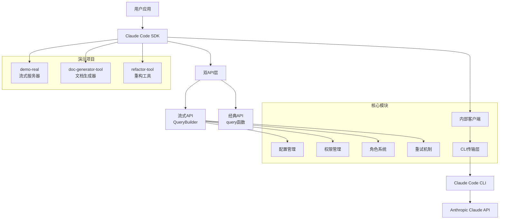
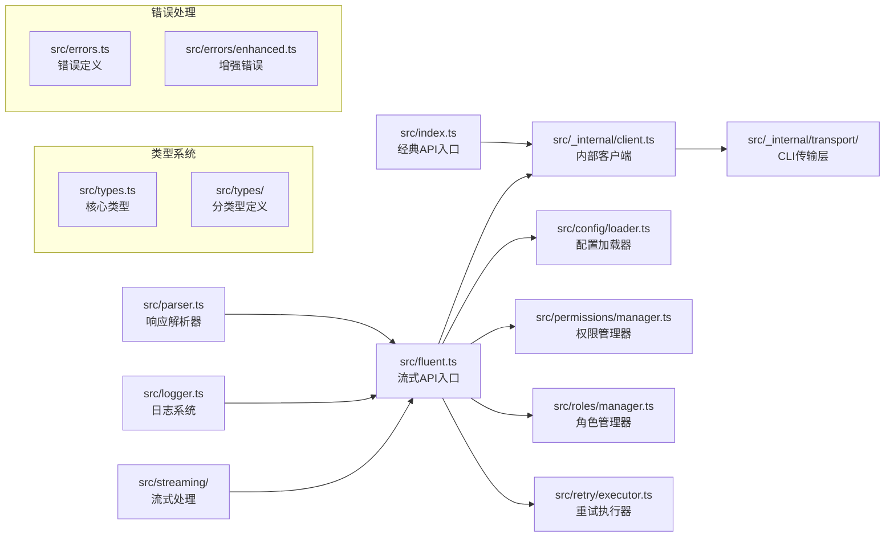
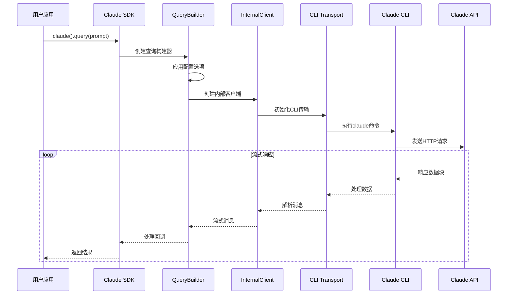
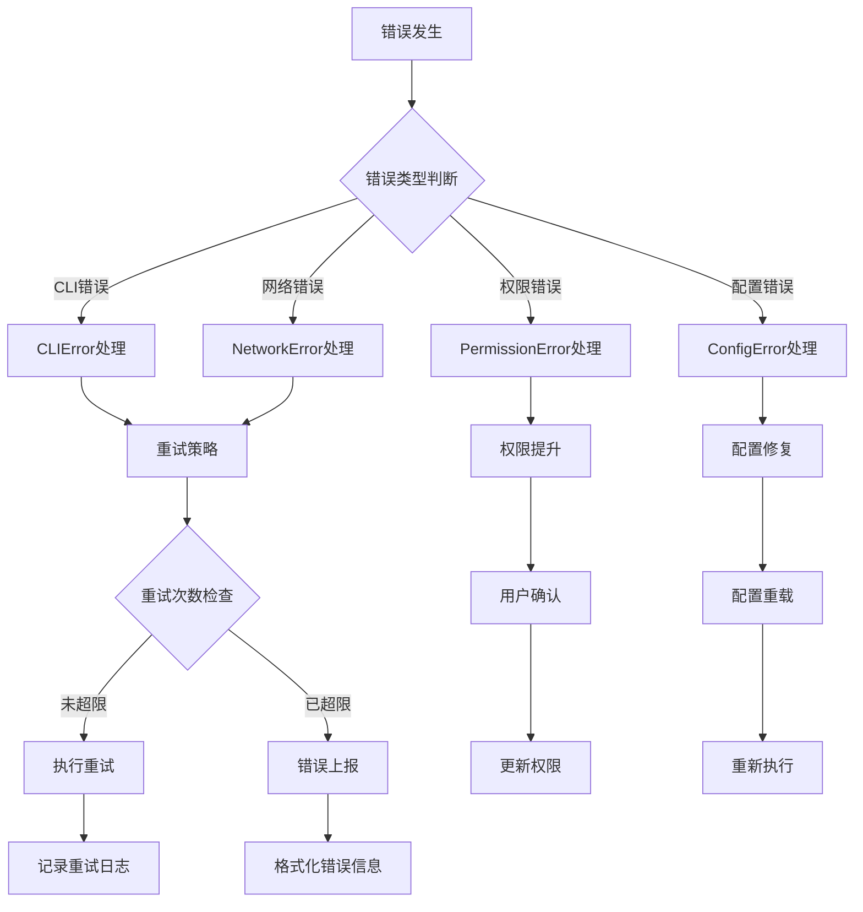

# cc-sdk-demo 项目技术总览

## 项目背景与使命

**cc-sdk-demo** 是一个完整的 TypeScript Claude Code SDK 项目，提供了 Claude AI 交互能力的现代化封装。该项目是官方 Python SDK 的非官方 TypeScript 移植版本，专为 Node.js 环境设计，提供了双 API 设计模式（经典异步生成器 + 现代链式流式 API）。

### 核心特性
- 🔄 **双API设计**: 同时支持经典异步生成器和现代链式流式API
- 🛡️ **权限管理系统**: 细粒度的工具访问控制和权限模式
- 📋 **配置管理**: 支持YAML/JSON配置文件和角色系统
- 🔁 **重试策略**: 内置智能重试机制和错误恢复
- 📊 **流式支持**: 令牌级和消息级流式处理
- 🧪 **全面演示**: 包含多个演示项目和集成示例

## 技术栈明细

### 核心技术栈
| 技术 | 版本 | 用途说明 |
|------|------|----------|
| **TypeScript** | ^5.3.0 | 主要开发语言，提供类型安全 |
| **Node.js** | >=18.0.0 | 运行时环境 |
| **ES Modules** | ES2022 | 现代JavaScript模块系统 |
| **tsup** | ^8.5.0 | 构建工具，支持双格式输出(ESM/CJS) |
| **execa** | ^8.0.1 | 进程执行库，用于CLI通信 |
| **js-yaml** | ^4.1.0 | YAML配置文件解析 |
| **which** | ^4.0.0 | 跨平台命令查找 |

### 开发工具链
| 工具 | 版本 | 用途说明 |
|------|------|----------|
| **Vitest** | ^3.2.4 | 测试框架 |
| **ESLint** | ^8.54.0 | 代码质量检查 |
| **Prettier** | ^3.1.0 | 代码格式化 |
| **TypeScript ESLint** | ^6.13.0 | TypeScript语法检查 |

### 演示项目技术栈
| 项目 | 技术栈 | 用途说明 |
|------|--------|----------|
| **demo-real** | Express.js + SSE | 流式响应演示服务器 |
| **doc-generator-tool** | TypeScript + CLI | AI驱动的文档生成工具 |
| **refactor-tool** | TypeScript + 代码分析 | 代码重构自动化工具 |

## 架构视图

### 1. 整体架构视图


### 2. 模块架构视图


### 3. 数据流架构视图


### 4. 部署架构视图
```mermaid
graph TB
    A[开发环境] --> B[构建系统<br/>tsup]
    B --> C[输出格式]
    C --> D[ESM格式<br/>dist/index.js]
    C --> E[CJS格式<br/>dist/index.cjs]
    C --> F[类型定义<br/>dist/index.d.ts]
    
    G[NPM发布] --> H[@instantlyeasy/claude-code-sdk-ts]
    
    I[演示部署] --> J[Railway平台]
    I --> K[Vercel平台]
    
    subgraph "部署目标"
        J
        K
        L[本地开发]
    end
    
    subgraph "包管理"
        H
        M[GitHub仓库]
    end
```

### 5. 错误处理架构视图


## 核心复杂流程分析

| 流程名称 | 复杂度 | 重要程度 | 文件位置 | 说明 |
|----------|--------|----------|----------|------|
| **流式API查询构建** | 高 | 核心 | `src/fluent.ts` | 链式配置和查询执行 |
| **CLI通信机制** | 高 | 核心 | `src/_internal/transport/` | 进程间通信和数据处理 |
| **权限管理系统** | 中 | 重要 | `src/permissions/` | 工具权限控制和验证 |
| **配置加载与合并** | 中 | 重要 | `src/config/loader.ts` | 多源配置文件处理 |
| **错误处理与重试** | 中 | 重要 | `src/retry/executor.ts` | 智能重试和错误恢复 |
| **角色模板系统** | 低 | 辅助 | `src/roles/manager.ts` | 角色定义和模板处理 |
| **响应解析处理** | 中 | 重要 | `src/parser.ts` | 多格式响应解析 |
| **流式数据处理** | 中 | 重要 | `src/streaming/` | 令牌级流式处理 |

## 项目结构分析

```
cc-sdk-demo/
├── 📦 核心SDK模块
│   ├── src/
│   │   ├── index.ts                     # 经典API入口
│   │   ├── fluent.ts                    # 流式API入口 (500+行)
│   │   ├── types.ts                     # 核心类型定义 (200+行)
│   │   ├── parser.ts                    # 响应解析器
│   │   ├── logger.ts                    # 日志系统
│   │   ├── errors.ts                    # 错误定义
│   │   └── _internal/                   # 内部实现
│   │       ├── client.ts                # 核心客户端
│   │       ├── options-merger.ts        # 选项合并
│   │       └── transport/               # CLI传输层
│   ├── config/                          # 配置管理
│   ├── permissions/                     # 权限系统
│   ├── retry/                          # 重试机制
│   ├── roles/                          # 角色系统
│   ├── streaming/                      # 流式处理
│   └── types/                          # 分类型定义
├── 🎨 演示项目
│   ├── demo-real/                      # 流式响应演示服务器
│   ├── doc-generator-tool/             # AI文档生成工具
│   └── refactor-tool/                  # 代码重构工具
├── 📚 示例代码
│   └── examples/                       # 使用示例集合
├── 🔧 配置文件
│   ├── package.json                    # 项目配置
│   ├── tsconfig.json                   # TypeScript配置
│   ├── tsup.config.ts                  # 构建配置
│   └── vitest.config.ts                # 测试配置
└── 🚀 部署脚本
    └── scripts/                        # 部署和管理脚本
```

## 关键代码指标

- **总代码行数**: 9,502行
- **核心SDK代码**: ~3,000行 (31.6%)
- **演示项目代码**: ~4,500行 (47.4%)
- **示例代码**: ~1,000行 (10.5%)
- **配置和脚本**: ~1,002行 (10.5%)
- **TypeScript覆盖率**: 100%
- **模块化程度**: 高 (30+ 独立模块)

## 技术特点与创新

### 1. 双API设计模式
```typescript
// 经典异步生成器API
for await (const message of query('Create a file')) {
  console.log(message);
}

// 现代链式流式API  
const result = await claude()
  .withModel('opus')
  .allowTools('Read', 'Write')
  .skipPermissions()
  .query('Create a file')
  .asText();
```

### 2. 细粒度权限控制
- 工具级权限管理
- 动态权限模式切换
- 安全的权限提升机制

### 3. 智能配置系统
- 多源配置文件支持 (YAML/JSON)
- 环境变量集成
- 角色模板系统

### 4. 企业级错误处理
- 分类错误类型
- 智能重试策略
- 详细错误诊断信息

## 演示项目分析

### demo-real (流式响应演示服务器)
- **技术栈**: Express.js + Server-Sent Events
- **特性**: 实时流式AI响应、多API模式、认证集成
- **代码量**: 565行主服务器代码

### doc-generator-tool (AI文档生成工具)
- **技术栈**: TypeScript CLI + Claude Code SDK
- **特性**: 自动项目分析、多种文档类型、智能代码理解
- **代码量**: 800+行核心代码

### refactor-tool (代码重构工具)
- **技术栈**: TypeScript + AST分析
- **特性**: 智能代码重构、备份机制、批量处理
- **代码量**: 500+行重构逻辑

## 质量保证体系

### 代码质量工具
- **ESLint**: TypeScript代码质量检查
- **Prettier**: 统一代码格式化
- **TypeScript**: 严格类型检查
- **Vitest**: 现代化测试框架

### 构建与发布
- **tsup**: 现代化构建工具
- **双格式输出**: ESM + CommonJS
- **类型定义**: 完整的.d.ts文件
- **NPM发布**: 自动化发布流程

## 部署与集成

### 支持的部署平台
- **Railway**: 生产环境部署
- **Vercel**: 静态资源和API部署
- **本地开发**: 完整的开发环境支持

### 集成方式
- **NPM包**: `@instantlyeasy/claude-code-sdk-ts`
- **ES模块**: 现代import语法
- **CommonJS**: 向后兼容支持
- **TypeScript**: 原生TypeScript支持

## 潜在问题与建议

### 🔍 发现的问题
1. **测试覆盖**: 缺少自动化测试用例
2. **文档完整性**: API文档需要更详细的说明
3. **性能优化**: 大型项目处理效率有待提升
4. **错误处理**: 部分边界情况处理不够完善

### 💡 改进建议
1. **增加测试覆盖**: 建立完整的单元测试和集成测试
2. **性能优化**: 实现流式处理优化和缓存机制
3. **文档改进**: 添加更多使用示例和最佳实践
4. **社区建设**: 建立issue模板和贡献指南

## 技术债务评估

| 类别 | 严重程度 | 优先级 | 预计工作量 |
|------|----------|--------|------------|
| 测试覆盖 | 高 | P1 | 2-3周 |
| 性能优化 | 中 | P2 | 1-2周 |
| 文档完善 | 中 | P2 | 1周 |
| 错误处理 | 低 | P3 | 3-5天 |

## 发展路线图

### 短期目标 (1-2个月)
- ✅ 完善测试覆盖率
- ✅ 优化流式处理性能
- ✅ 增加更多示例代码

### 中期目标 (3-6个月)
- ✅ 社区生态建设
- ✅ 插件系统开发
- ✅ 企业级功能增强

### 长期目标 (6-12个月)
- ✅ 多语言支持
- ✅ 云端服务集成
- ✅ AI能力扩展

---

*文档生成时间: 2025-08-15T16:15:00Z*  
*分析工具: Claude Code 文档生成器*  
*项目版本: 0.3.3*  
*SDK版本: @instantlyeasy/claude-code-sdk-ts*