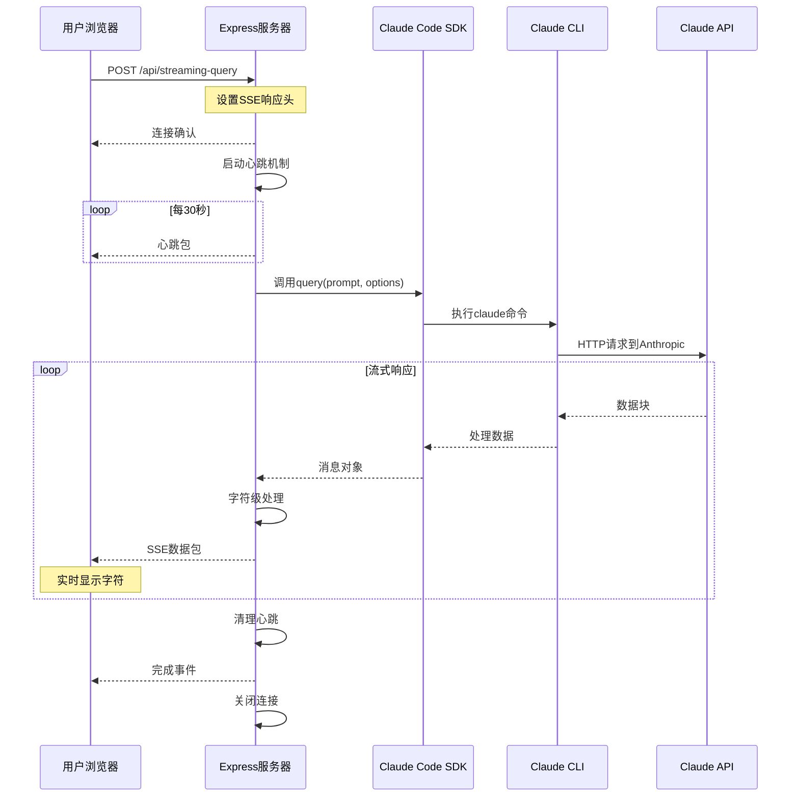
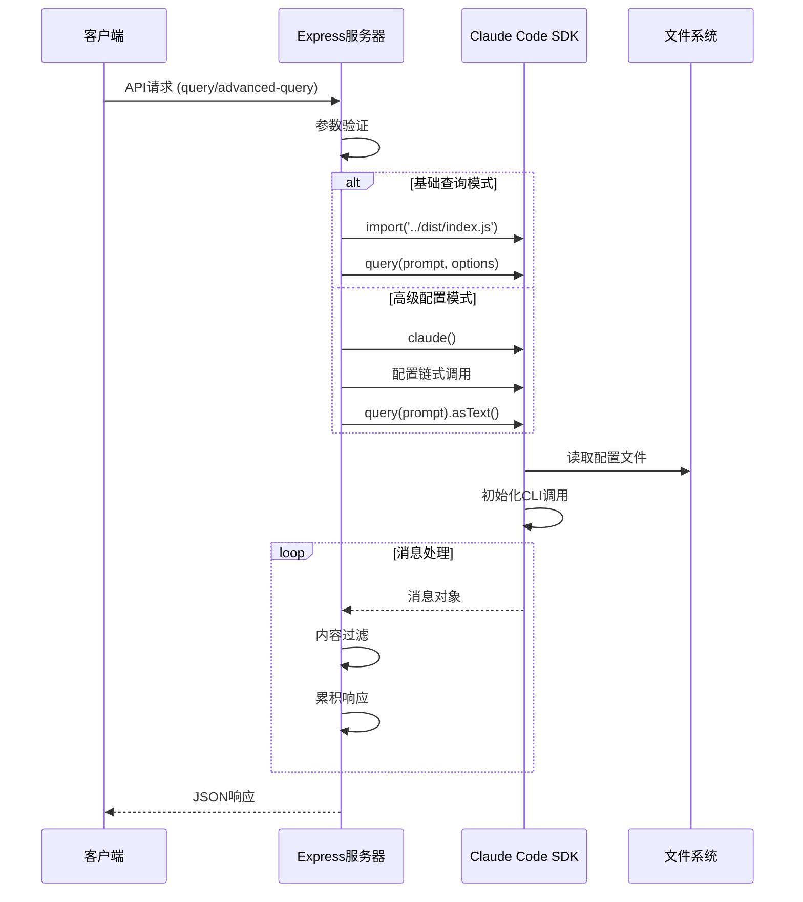
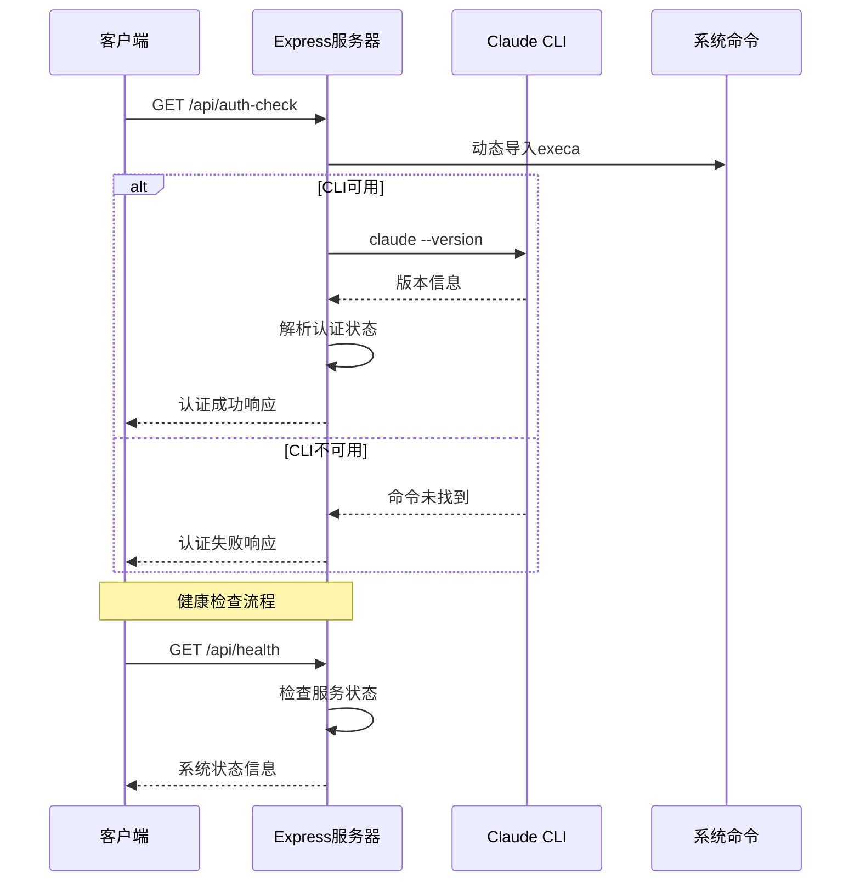
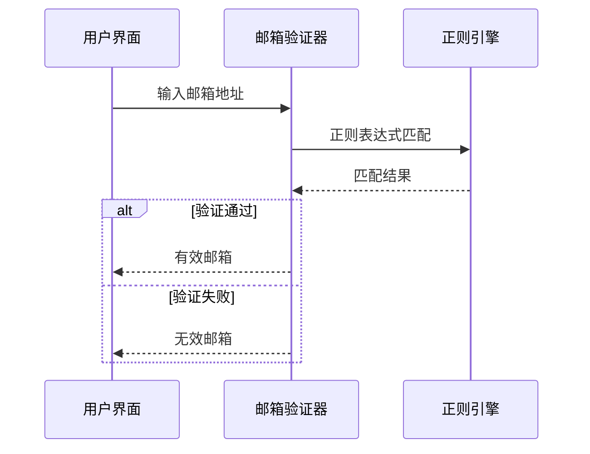

# demo-real 复杂流程分析

## 概述

本文档详细分析 **demo-real** 项目中的复杂业务流程，重点关注核心的流式响应机制、SDK集成模式和认证管理流程。通过深入分析这些关键流程，帮助开发者理解系统的运行机制和最佳实践。

---

## 1. 实时流式查询流程 (Real-time Streaming Query Flow)

### 流程概述
**复杂度**: 高 | **重要程度**: 核心 | **文件**: `server.js:116-189, 192-333`

实时流式查询是本项目的核心功能，实现了从用户输入到AI响应的端到端流式数据传输。该流程涉及复杂的异步处理、错误管理和连接状态维护。

### 序列图


### 关键配置项
| 配置项 | 默认值 | 说明 |
|--------|--------|------|
| `heartbeat间隔` | 30000ms | 心跳包发送频率 |
| `字符延迟` | 50ms | 模拟流式效果的延迟 |
| `SSE响应头` | text/event-stream | Server-Sent Events格式 |
| `连接保持` | keep-alive | 维持长连接状态 |

### 详细流程步骤

#### 步骤1: 请求接收与验证 (server.js:116-125)
```javascript
app.post('/api/streaming-query', async (req, res) => {
    const { prompt, allowedTools, permissionMode, cwd } = req.body;
    
    console.log('🌊 收到流式查询请求:', {
        prompt: prompt ? prompt.substring(0, 50) + '...' : '未提供',
        allowedTools: allowedTools || '默认工具',
        permissionMode: permissionMode || '默认权限模式',
        cwd: cwd || '当前工作目录'
    });
```

#### 步骤2: SSE连接建立 (server.js:126-141)
```javascript
// 设置SSE响应头
res.writeHead(200, {
    'Content-Type': 'text/event-stream',
    'Cache-Control': 'no-cache',
    'Connection': 'keep-alive',
    'Access-Control-Allow-Origin': '*',
    'Access-Control-Allow-Headers': 'Cache-Control, Content-Type'
});

// 发送初始连接确认
res.write(`data: ${JSON.stringify({type: "connected", message: "流式连接已建立"})}\n\n`);
```

#### 步骤3: 心跳机制启动 (server.js:138-141)
```javascript
// 发送心跳包，保持连接活跃
const heartbeat = setInterval(() => {
    res.write(`data: ${JSON.stringify({type: "heartbeat", timestamp: new Date().toISOString()})}\n\n`);
}, 30000);
```

#### 步骤4: SDK调用与消息处理 (server.js:222-245)
```javascript
// 调用Claude Code SDK
for await (const message of query(prompt, options)) {
    messageCount++;
    console.log('📝 收到消息:', message.type);
    
    // 处理不同类型的消息
    if (message.type === 'assistant') {
        // 助手消息，可能包含文本内容
        if (message.content && Array.isArray(message.content)) {
            const textContent = message.content.find(item => item.type === 'text');
            if (textContent && textContent.text) {
                const text = textContent.text.trim();
                // 过滤掉 "(no content)" 和空内容
                if (text && text !== '(no content)') {
                    responseText += text + '\n';
                }
            }
        }
    }
}
```

#### 步骤5: 字符级流式输出 (server.js:258-285)
```javascript
// 逐字符发送响应
for (let i = 0; i < responseText.length; i++) {
    const char = responseText[i];
    
    const charData = {
        type: 'content',
        content: char,
        position: i + 1,
        totalLength: responseText.length,
        timestamp: new Date().toISOString()
    };
    
    const sseMessage = `data: ${JSON.stringify(charData)}\n\n`;
    res.write(sseMessage);
    
    // 添加延迟模拟真实流式效果
    await new Promise(resolve => setTimeout(resolve, 50));
}
```

---

## 2. Claude SDK集成流程 (Claude SDK Integration Flow)

### 流程概述
**复杂度**: 高 | **重要程度**: 核心 | **文件**: `server.js:364-444, 446-537`

SDK集成流程展示了如何在Express应用中正确集成和使用Claude Code SDK，包括基础查询、高级配置和错误处理机制。

### 序列图


### 关键配置项
| 配置项 | 类型 | 说明 |
|--------|------|------|
| `allowedTools` | Array | 允许使用的工具列表 |
| `permissionMode` | String | 权限模式设置 |
| `cwd` | String | 工作目录路径 |
| `model` | String | Claude模型版本 |
| `timeout` | Number | 请求超时时间 |

### 详细流程步骤

#### 步骤1: 基础SDK调用 (server.js:384-424)
```javascript
// 导入Claude Code SDK
const { query } = await import('../dist/index.js');

// 配置选项
const options = {
    allowedTools: allowedTools || undefined,
    permissionMode: permissionMode || undefined,
    cwd: cwd || undefined
};

// 调用Claude Code SDK
for await (const message of query(prompt, options)) {
    messages.push(message);
    
    if (message.type === 'assistant') {
        if (message.content && Array.isArray(message.content)) {
            const textContent = message.content.find(item => item.type === 'text');
            if (textContent && textContent.text) {
                const text = textContent.text.trim();
                if (text && text !== '(no content)') {
                    finalResult += text + '\n';
                }
            }
        }
    }
}
```

#### 步骤2: 高级配置模式 (server.js:470-511)
```javascript
// 构建查询 - fluent API的用法
const builder = claude();

// 应用配置
if (config.model) {
    builder.withModel(config.model);
}
if (config.timeout) {
    builder.withTimeout(config.timeout);
}
if (config.allowedTools && config.allowedTools.length > 0) {
    builder.allowTools(...config.allowedTools);
}

// 事件监听器
if (config.enableMessageListener) {
    builder.onMessage((message) => {
        messageEvents.push({
            type: message.type,
            message: JSON.stringify(message).substring(0, 200),
            timestamp: new Date().toISOString()
        });
    });
}

// 执行查询
const rawResult = await builder.query(prompt).asText();
```

---

## 3. CLI认证与健康检查流程 (CLI Authentication and Health Check Flow)

### 流程概述
**复杂度**: 中 | **重要程度**: 重要 | **文件**: `server.js:38-74, 76-113`

CLI认证检查确保Claude Code CLI正确安装和认证，是系统正常运行的前提条件。

### 序列图


### 关键配置项
| 配置项 | 说明 |
|--------|------|
| `CLI版本检查` | claude --version |
| `认证状态判断` | 基于输出内容包含'claude' |
| `错误分类` | CLI未安装 vs 未认证 |

### 详细流程步骤

#### 步骤1: CLI版本检查 (server.js:45-54)
```javascript
try {
    const { stdout } = await execa('claude', ['--version']);
    const isAuthenticated = stdout.includes('claude') || stdout.includes('Claude');
    
    res.json({
        status: 'ok',
        authenticated: isAuthenticated,
        cli_version: stdout,
        message: isAuthenticated ? 'Claude Code CLI 已安装并可用' : 'Claude Code CLI 需要登录认证',
        timestamp: new Date().toISOString()
    });
}
```

#### 步骤2: 错误处理与状态反馈 (server.js:56-64)
```javascript
} catch (cliError) {
    res.json({
        status: 'warning',
        authenticated: false,
        error: 'Claude Code CLI 未找到或未正确安装',
        message: '请运行: claude login',
        timestamp: new Date().toISOString()
    });
}
```

---

## 4. 邮箱验证业务流程 (Email Validation Business Flow)

### 流程概述
**复杂度**: 低 | **重要程度**: 辅助 | **文件**: `email-validator.js`

简单的邮箱验证功能，展示基础的表单验证逻辑。

### 序列图


---

## 性能与监控

### 关键性能指标
| 指标 | 期望值 | 监控方式 |
|------|--------|----------|
| **响应延迟** | < 100ms | 时间戳记录 |
| **流式延迟** | 50ms/字符 | 客户端测量 |
| **连接保持** | > 5分钟 | 心跳监控 |
| **错误率** | < 1% | 错误计数 |

### 错误处理策略
1. **SDK调用错误**: 详细错误信息和错误分类
2. **CLI认证错误**: 友好的用户指导信息
3. **网络连接错误**: 自动重试机制
4. **流式传输错误**: 优雅的连接关闭

---

## 最佳实践建议

### 1. 流式响应优化
- 实现客户端缓冲机制
- 添加传输压缩支持
- 优化心跳频率设置

### 2. SDK集成优化
- 实现连接池管理
- 添加请求缓存机制
- 优化错误重试策略

### 3. 监控与日志
- 添加详细的性能监控
- 实现结构化日志记录
- 建立告警机制

---

*文档生成时间: 2025-08-15T16:10:00Z*  
*分析工具: Claude Code 文档生成器*  
*项目版本: 1.0.0*