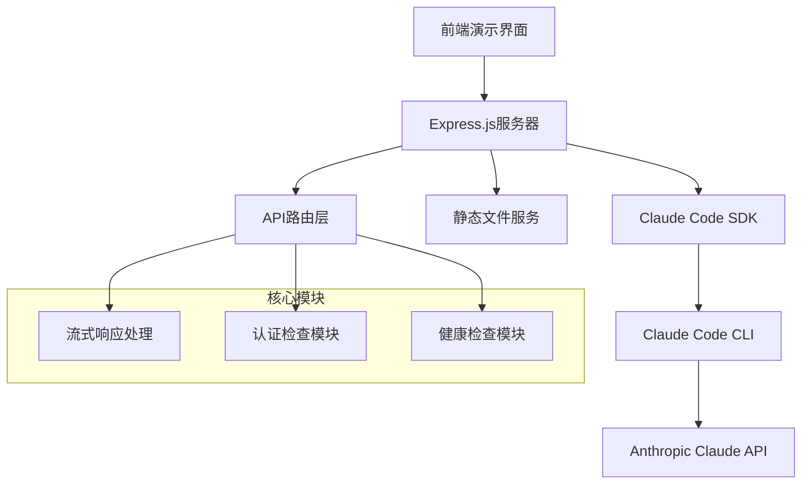
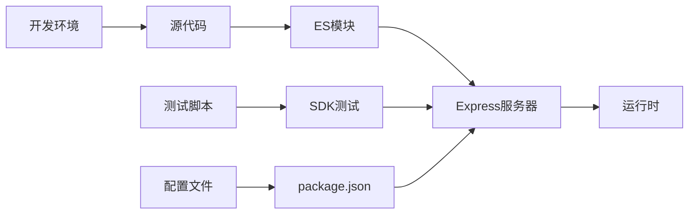
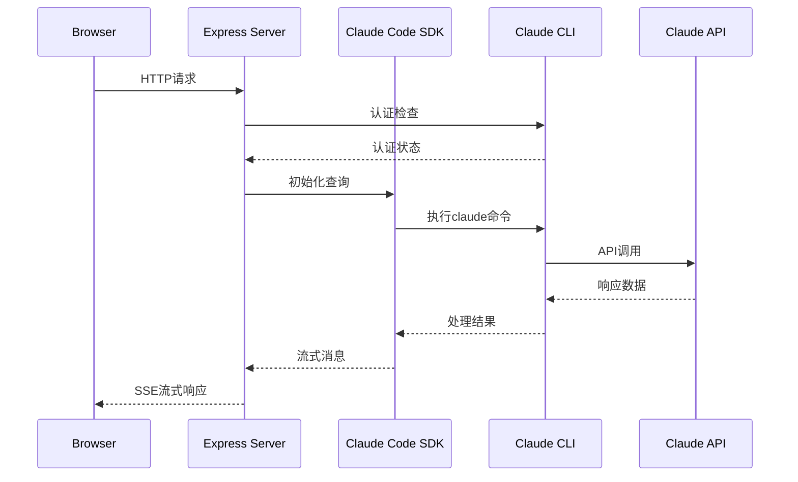
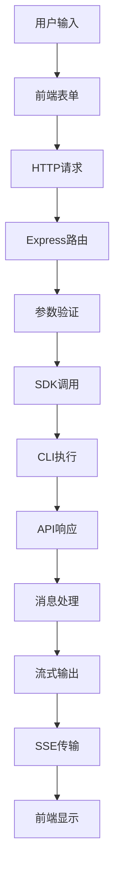

# demo-real 项目技术总览

## 项目背景与使命

**demo-real** 是一个基于 Claude Code SDK 的流式响应演示服务器，展示了如何在实际应用中集成和使用 Claude AI 能力。该项目的核心目标是提供一个完整的、可运行的示例，帮助开发者理解如何构建基于 Claude 的实时交互应用。

### 核心特性
- 🌊 **实时流式响应**: 支持服务器发送事件(SSE)的流式数据传输
- 🔐 **认证管理**: 集成 Claude Code CLI 认证检查
- 🔧 **多种API模式**: 支持GET/POST、同步/异步、基础/高级配置
- 📱 **前端演示**: 提供完整的HTML演示界面
- 🧪 **SDK测试**: 包含完整的测试套件和验证工具

## 技术栈明细

### 后端技术栈
| 技术 | 版本 | 用途说明 |
|------|------|----------|
| **Node.js** | Latest | JavaScript运行时环境 |
| **Express.js** | ^4.18.2 | Web应用框架，处理HTTP请求路由 |
| **ES Modules** | ES2022 | 使用现代JavaScript模块系统 |
| **axios** | ^1.11.0 | HTTP客户端，用于API调用测试 |
| **cors** | ^2.8.5 | 跨域资源共享中间件 |
| **execa** | Dynamic | 进程执行库，用于CLI集成 |

### 前端技术栈
| 技术 | 用途说明 |
|------|----------|
| **HTML5** | 结构化内容和演示界面 |
| **Vanilla JavaScript** | 原生JS实现，无框架依赖 |
| **EventSource API** | 处理服务器发送事件(SSE) |
| **CSS3** | 样式和布局 |

### 集成技术
- **Claude Code SDK**: 核心AI交互能力
- **Claude Code CLI**: 认证和配置管理
- **Server-Sent Events**: 实时数据流传输

## 架构视图

### 1. 逻辑架构视图


### 2. 开发架构视图


### 3. 部署架构视图
```mermaid
graph TB
    A[用户浏览器] --> B[HTTP/HTTPS]
    B --> C[Express服务器:3002]
    C --> D[Claude Code CLI]
    D --> E[本地文件系统]
    
    C --> F[静态资源]
    C --> G[API端点]
    G --> H[/api/streaming-query]
    G --> I[/api/auth-check]
    G --> J[/api/health]
```

### 4. 运行时架构视图


### 5. 数据流视图


## 核心复杂流程分析

| 流程名称 | 复杂度 | 重要程度 | 说明 |
|----------|--------|----------|------|
| **实时流式查询流程** | 高 | 核心 | 处理用户查询并实时返回AI响应 |
| **Claude SDK集成流程** | 高 | 核心 | 集成和调用Claude Code SDK |
| **CLI认证与健康检查流程** | 中 | 重要 | 验证CLI状态和认证信息 |
| **邮箱验证业务流程** | 低 | 辅助 | 演示基础的表单验证功能 |
| **高级配置查询流程** | 中 | 重要 | 支持复杂的SDK配置选项 |
| **错误处理与监控流程** | 中 | 重要 | 统一的错误处理和状态监控 |

## 项目结构分析

```
demo-real/
├── 📋 配置文件
│   └── package.json                 # 项目依赖和脚本配置
├── 🚀 核心服务
│   └── server.js                    # Express主服务器(565行)
├── 🧪 测试与验证
│   ├── test-claude-sdk.js          # SDK集成测试
│   └── test-sdk.js                 # 基础SDK测试
├── 🎨 前端演示
│   ├── simple-real-demo.html       # 主演示界面
│   └── test-newlines.html          # 换行符测试页面
├── ⚙️ 工具脚本
│   ├── claude_code_prod.sh         # 生产环境Claude配置
│   ├── init-claude-auth.sh         # CLI认证初始化
│   └── start-server.sh             # 服务器启动脚本
├── 🔧 业务模块
│   ├── email-validator.js          # 邮箱验证工具
│   └── hello.js                    # 基础示例模块
└── 📚 文档
    ├── demo-real-Technical-Overview.md
    ├── demo-real-Complex-Flow-Analysis.md
    └── demo-real-Problem-Diagnosis-Solution.md
```

## 关键代码指标

- **总代码行数**: 794行
- **主服务器代码**: 565行 (占71.2%)
- **测试代码覆盖**: 2个测试文件
- **API端点数量**: 7个核心端点
- **前端页面**: 2个演示页面
- **配置脚本**: 3个Shell脚本

## 技术特点与创新

### 1. 流式响应设计
- 实现真正的字符级流式输出
- 支持心跳机制保持连接活跃
- 优雅的错误处理和连接管理

### 2. 多层API设计
- 基础查询API (`/api/claude-sdk-query`)
- 流式响应API (`/api/streaming-query`)
- 高级配置API (`/api/advanced-query`)

### 3. CLI集成模式
- 无需API密钥的安全认证
- 自动检测CLI状态和版本
- 统一的错误处理和状态反馈

## 潜在问题与建议

### 🔍 发现的问题
1. **依赖安全性**: 动态导入外部模块可能存在安全风险
2. **错误处理**: 部分异常情况缺少具体的错误分类
3. **测试覆盖**: 缺少自动化测试框架和CI/CD集成
4. **文档完整性**: API文档需要更详细的参数说明

### 💡 改进建议
1. **增加安全措施**: 实现请求频率限制和输入验证
2. **完善监控**: 添加性能监控和日志记录系统
3. **扩展测试**: 建立完整的单元测试和集成测试
4. **优化性能**: 考虑连接池和缓存机制

## 技术债务评估

| 类别 | 严重程度 | 优先级 | 建议处理时间 |
|------|----------|--------|--------------|
| 安全性 | 中 | 高 | 1-2周 |
| 测试覆盖 | 高 | 中 | 2-3周 |
| 文档完整性 | 中 | 中 | 1周 |
| 性能优化 | 低 | 低 | 1个月 |

---

*文档生成时间: 2025-08-15T16:08:00Z*  
*生成工具: Claude Code 文档生成器*  
*项目版本: 1.0.0*